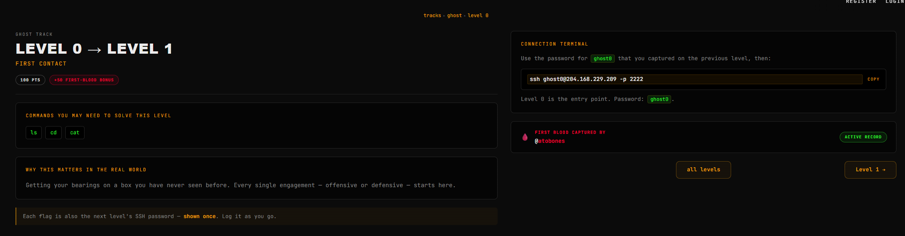
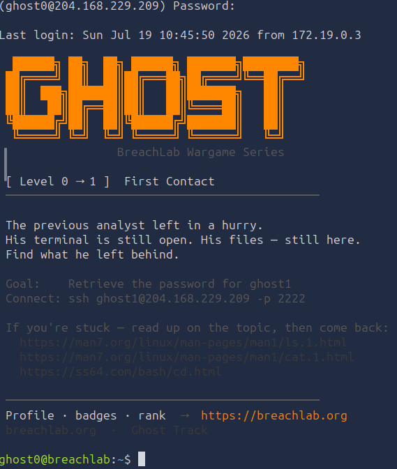
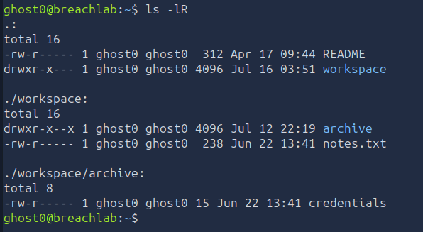
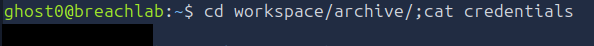

# Level 0 - First Contact
---
**Category:**  Linux Exploitation
**Points:** 100
**Difficulty:** Beginner-
**Link:** https://breachlab.org/tracks/ghost/0

## 📋 Description:
Getting your bearings on a box you have never seen before. Every single engagement - offensive or defensive - starts here.

## 🔍 Reconnaissance:
1. Opened the challenge page  


## 🛠️ Tools Used:
- ssh
- ls
- cd
- cat

## 🚀 Solution:

### Step 1:
Connected using ssh to the target using the provided credentials:

```bash
ssh ghost0@204.168.229.209 -p 2222
```


### Step 2:
Scanned through the home directory:

```bash
ls -lRa
```


### Step 3:
Found credentials.txt and opened it to find the password:

```bash
cat credentials.txt
```


### Step 4:
Moved on to the next level using the found password.