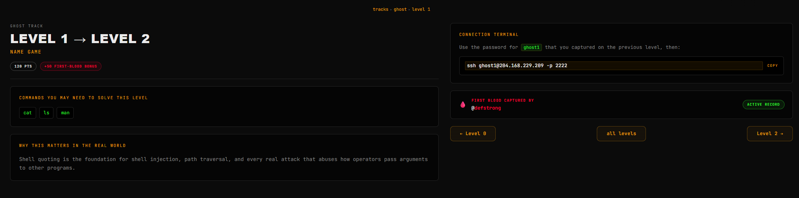
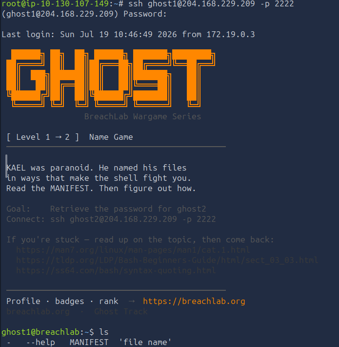
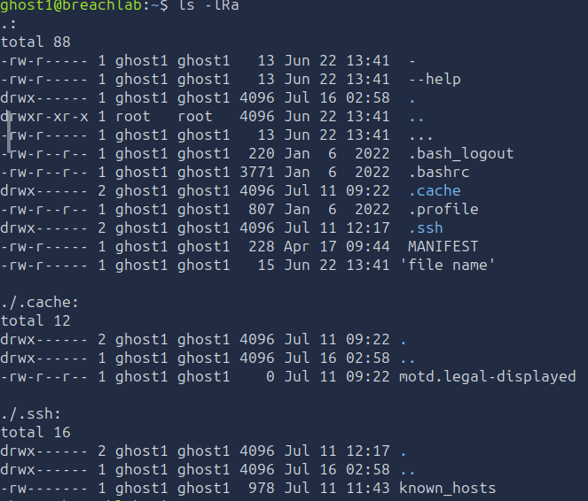
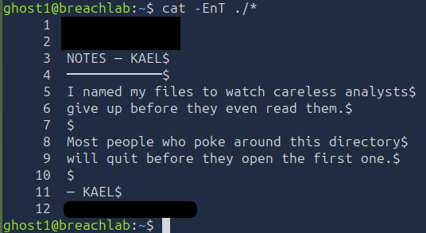
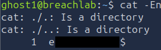

# Level 1 - Name Game
---
**Category:**  Linux Exploitation

**Points:** 120

**Difficulty:** Beginner-

**Link:** https://breachlab.org/tracks/ghost/1

## 📋 Description:
Shell quoting is the foundation for shell injection, path traversal, and every real attack that abuses how operators pass arguments to other programs.

## 🔍 Reconnaissance:
1. Opened the challenge page:

2. Checked the bash explanation on shell quoting at: https://tldp.org/LDP/Bash-Beginners-Guide/html/sect_03_03.html

## 🛠️ Tools Used:
- ssh
- ls
- cat

## 🚀 Solution:

### Step 1:
Connected using ssh to the target using the credentials found in Challenge 0:

```bash
ssh ghost1@204.168.229.209 -p 2222
```


### Step 2:
Scanned through the home directory:

```bash
ls -lRa
```


Immediately, I see multiple files that have weird names... Notably:
-rw-r----- 1 ghost1 ghost1   13 Jun 22 13:41  -
-rw-r----- 1 ghost1 ghost1   13 Jun 22 13:41  --help
-rw-r----- 1 ghost1 ghost1   13 Jun 22 13:41  ...
-rw-r----- 1 ghost1 ghost1   15 Jun 22 13:41 'file name'

### Step 3:
Now most of the time, for outputting files in bash we would use the format: 

```bash
cat <file_name>
```

However here, it would not work because in bash, "cat -" means reading from standard input (What the user types), while "cat --help" would just give us the help page for cat.

So immediately, I think it's better to just check the content of all files in the directory using: 
```bash
cat -EnT ./*
```
- E prints the end of lines using "$"
- n prints the line numbers
- T prints the tabs as ^I special characters, just for formatting purposes.

I thought of using -v for non printable characters but I didn't think it would be needed at this point in time.



Now, we can see that indeed, we get most of the files, however "..." is missing because it starts with "." and in linux file systems, this is used to create "hidden" files, as such it wouldn't be acted amongst "./\*" but "./.\*"

So we have to use the following command to get the hidden files as well:

```bash
cat -EnT ./.*
```
And here we have our file output:



### Step 4:
Moved on to the next level using the password in one of the files.

