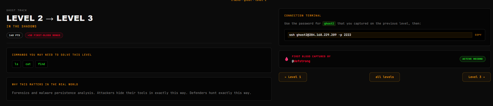
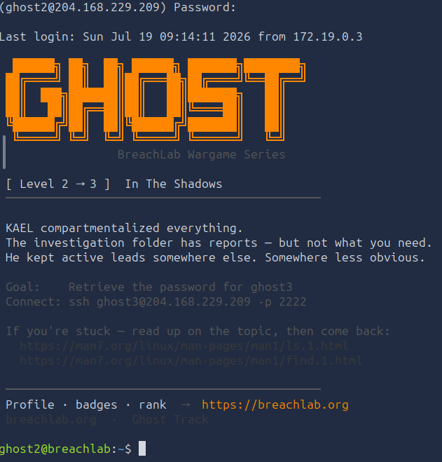
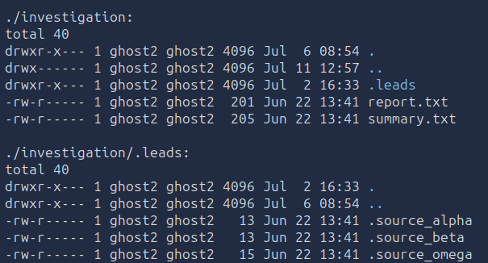
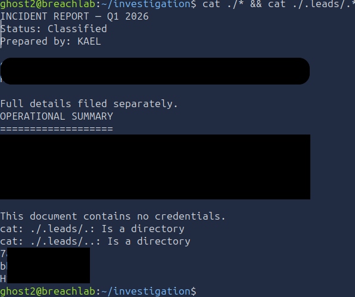

# Level 2 - In the shadows
---
**Category:**  Linux Exploitation

**Points:** 140

**Difficulty:** Beginner-

**Link:** https://breachlab.org/tracks/ghost/2

## 📋 Description:
Forensics and malware persistence analysis. Attackers hide their tools in exactly this way. Defenders hunt exactly this way.


## 🔍 Reconnaissance:
1. Opened the challenge page  


## 🛠️ Tools Used:
- ssh
- find
- ls
- cat

## 🚀 Solution:

### Step 1:
Connected using ssh to the target using the credentials found in Challenge 1:

```bash
ssh ghost2@204.168.229.209 -p 2222
```


### Step 2:
As usual, scanned through the home directory:

```bash
ls -lRa
```
We get a bunch of directories but nothing that directly stands out.
However we do notice as directory named "investigation" once we scroll all the way down.



Based on the file sizes, I already have an idea of which file has the password.

### Step 3:
Now let's see what's in those files.

```bash
cd investigation; cat ./* && cat ./.leads/*
```

This gives us the password to move to the next step.

### Step 4:
Moved on to the next level using the password in one of the files.

