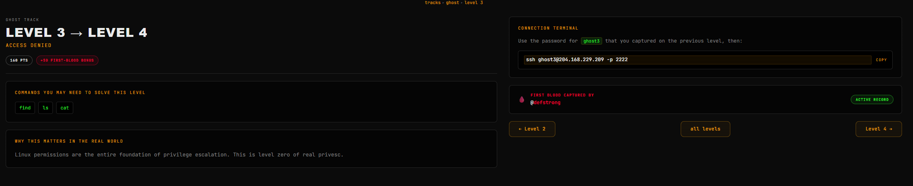
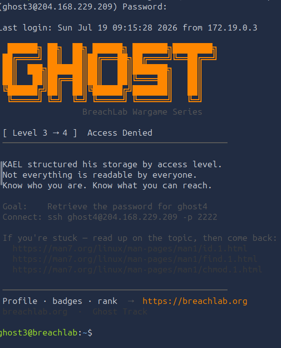
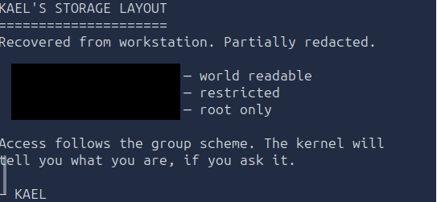
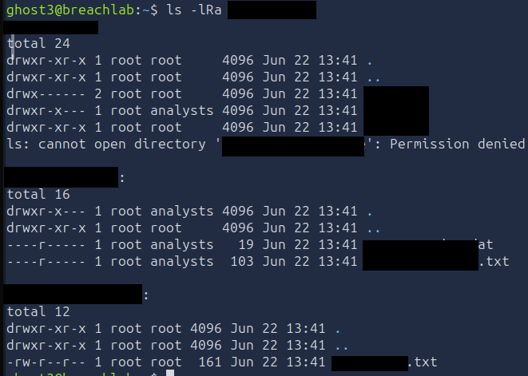
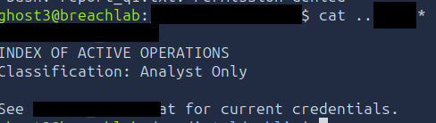

# Level 3 - Access Denied
---
**Category:**  Linux Exploitation

**Points:** 160

**Difficulty:** Beginner

**Link:** https://breachlab.org/tracks/ghost/3

## 📋 Description:
Linux permissions are the entire foundation of privilege escalation. This is level zero of real privesc.


## 🔍 Reconnaissance:
1. Opened the challenge page  

2. Checked out the man pages for id an chmod at:
https://man7.org/linux/man-pages/man1/id.1.html
and:
https://man7.org/linux/man-pages/man1/chmod.1.html

## 🛠️ Tools Used:
- ssh
- id
- ls
- cat

## 🚀 Solution:

### Step 1:
Connected using ssh to the target using the credentials found in Challenge 2:

```bash
ssh ghost3@204.168.229.209 -p 2222
```


### Step 2:
As usual, scanned through the home directory:

```bash
ls -lRa
```
Nothing to see except a map.txt file.

After opening the file, we can see that it contains paths to directories with mention of permissions.



### Step 3:
Now immediately based on the file output, I thought about the permissions right? Clearly this challenge is about permissions, else we wouldn't have chmod and stuff.

Therefore, I checked the the groups I am part of using id:


We can I am part of three groups. One of those is important for the next part.

### Step 4:
So I went ahead and scanned through the entire directory of the challenge to find multiple files:


We can see that we have that the group analysts has read access to the files in the middle directory. Considering we're part of that group, we can totally read them. And based on the file name... We can deduct which contains what.

### Step 5:
Went ahead and got file output to get the password for the next challenge:


### Step 6:
Moved on to the next level using the password in one of the files.

