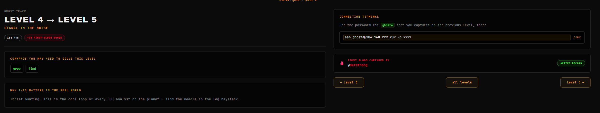
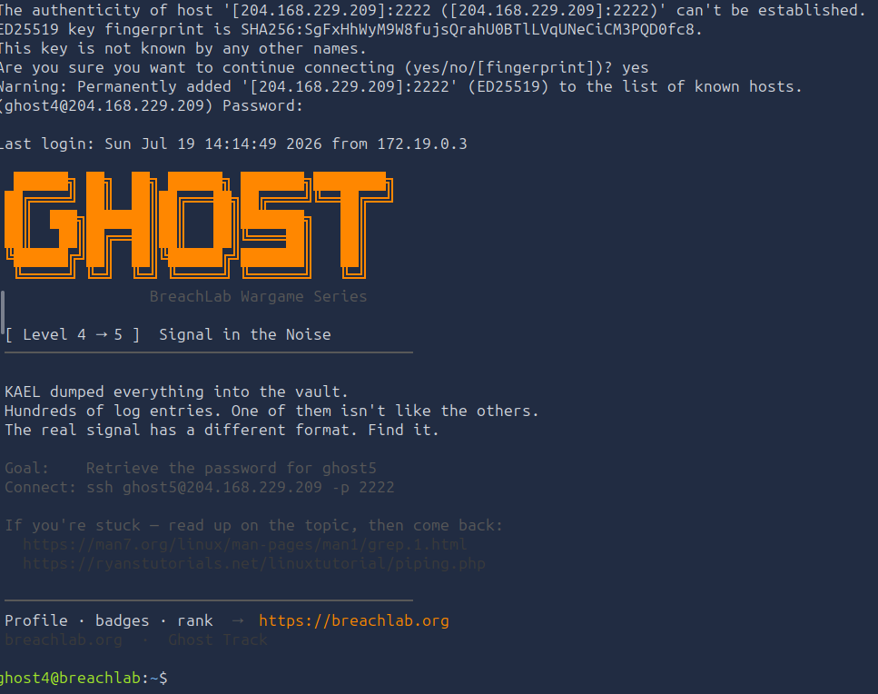
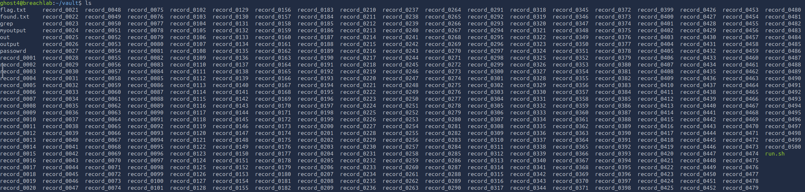
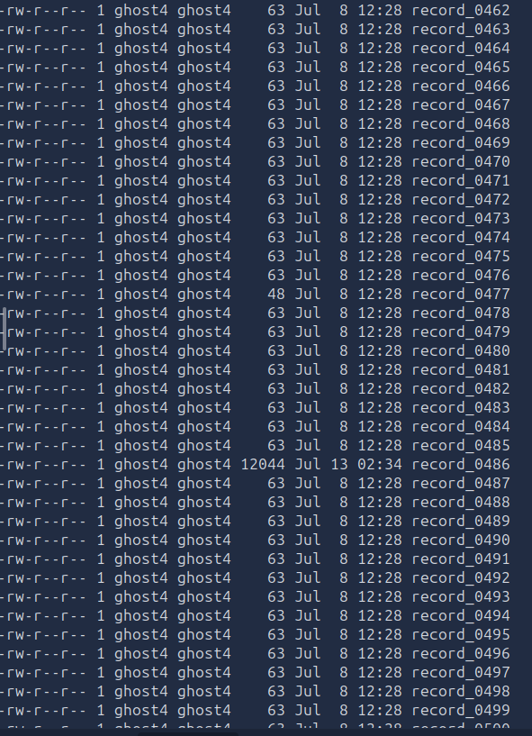
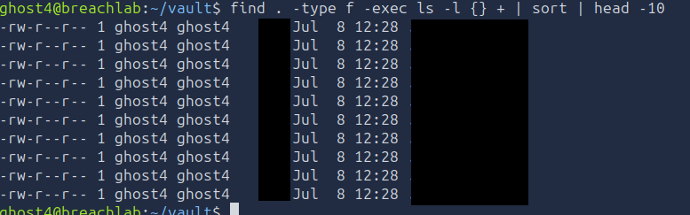
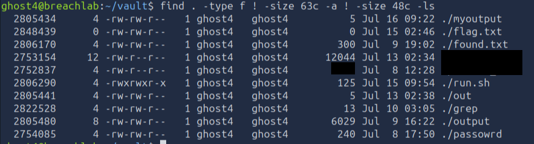
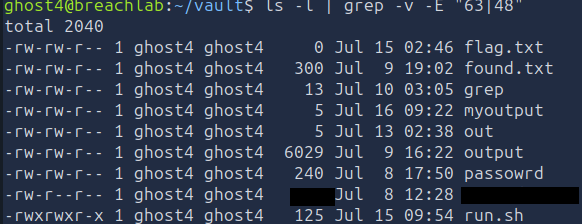
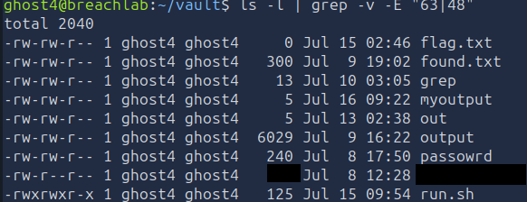
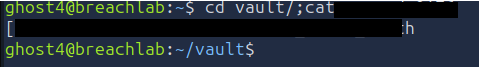

# Level 4 - Signal in the Noise
---
**Category:**  Linux Exploitation

**Points:** 180

**Difficulty:** Beginner+

**Link:** https://breachlab.org/tracks/ghost/4

## 📋 Description:
Threat hunting. This is the core loop of every SOC analyst on the planet - find the needle in the log haystack.


## 🔍 Reconnaissance:
1. Opened the challenge page


## 🛠️ Tools Used:
- ssh
- grep
- ls
- find
- cat

## 🚀 Solution:

### Step 1:
Connected using ssh to the target using the credentials found in Challenge 3:

```bash
ssh ghost4@204.168.229.209 -p 2222
```


### Step 2:
As usual, scanned through the home directory:

```bash
ls -lRa
```
Now, this is pretty interesting... 



We have a ton of files. Clearly a lot to go through, but... A lot of them are just filled with useless stuff. Let's take one at random for an example. A lot of them seem to be user generated tho, I'll be cleaning all of them up later.

### Step 3:
Checking file contents.

Right so, I got lucky and found the password on my second example... But anyways, doesn't matter...

Point is, you'll have a hard time finding it randomly, unless you're really lucky.

But anyhow, with that being said I still have a methodology to find the file. Obviously there is multiple ways to do so, I will be enumerating three.

### Step 4.1:
The easiest way to do it is to filter by size, now you can do this manually by doing:

```bash
ls -l
```


And then using your eyeballs to filter the sizes, most of what I see is either 63 or 48.

Or you can do this automatically with the find command:
```bash
find . -type f -exec ls -l {} + | sort | head -10
```
We find on our current directory, for all files and for all we execute the ls -l command on the entire group of files, we sort from smallest to biggest and we only take the first 10 and output them.



Now, this will give you the top 10 smallest files, but you can also use the -size flag to filter by size. For example, if you want to find all files that are 48 bytes in size, you can do:
```bash
find . -type f -size 48c
```
Although this will not be sorted.

Anyways, if we want to truly sort it by weird files however (cause it won't always be the smallest one), then we have to be more creative.

```bash
find . -type f ! -size 63c -a ! -size 48c -ls
```
Now concretely what this is we filter for all files that ARE NOT sizes of 63 or 48 and we output in a detailed format.

This gives us:



The censored files are the ones containing the password. This is one way to filter out the noise. The other files are from people who fail to clean up their trace on the system once they're done using it, which is unfortunate.

### Step 4.2:
Another way we can do this automatically is using a pipe with the grep command:
```bash
ls -l | grep -v -E "63|48"
```


List the files, and inverse grep the size (which will NOT accept the sizes in input instead of accepting them, that's the -v parameter), -E is for extended regex.

### Step 4.3:
Until now, we've filtered the files...

We haven't however filtered the contents of them. And we can in one very simple command. It actually looks very similar to the last one.

We could use a loop to go through all files and filter the contents, it isn't the most practical tho, one line suffices.

```bash
cat * | grep -v -E "STATUS|password"
```
Now, what this does is simple, we concatenate all of the files' content together, and we send that to grep to only display what DOES NOT contain neither STATUS or password (the two that show up the most in the files)

For the sake of the screenshot, I also had to filter with "record" but that's because some people have replaced one file with an ls ouput... and yeah...)



### Step 5:
Anyhow, depending on the way you did it, you might get the password directly, or not.

Either way, just cat the file.



### Step 6:
Cleaned up with:
```bash
find . ! -size 63c -a ! -size 48c -a ! -size xxxc -exec rm {} \;
```
To remove all files which aren't meant to be in the folder. (Any file that isn't size of 63, 48 and the password file)

### Step 7:
Moved on to the next level using the password in one of the files.