# Level 5 - The Listener
---
**Category:**  Linux Exploitation

**Points:** 200

**Difficulty:** Beginner+

**Link:** https://breachlab.org/tracks/ghost/5

## 📋 Description:
Network reconnaissance and banner grabbing. The opening move in every pentest.


## 🔍 Reconnaissance:
1. Opened the challenge page  
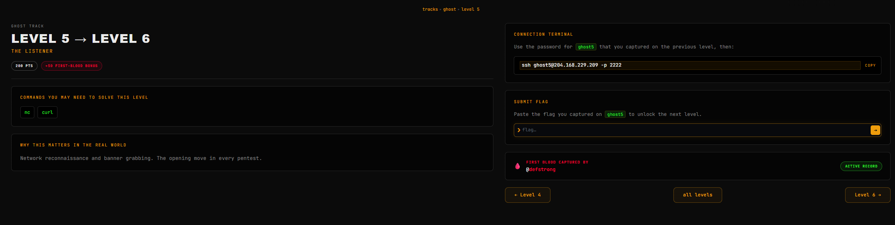

## 🛠️ Tools Used:
- ssh
- curl
- bash
- nmap
- nc

## 🚀 Solution:

### Step 1:
Connected using ssh to the target using the credentials found in Challenge 4:

```bash
ssh ghost5@204.168.229.209 -p 2222
```
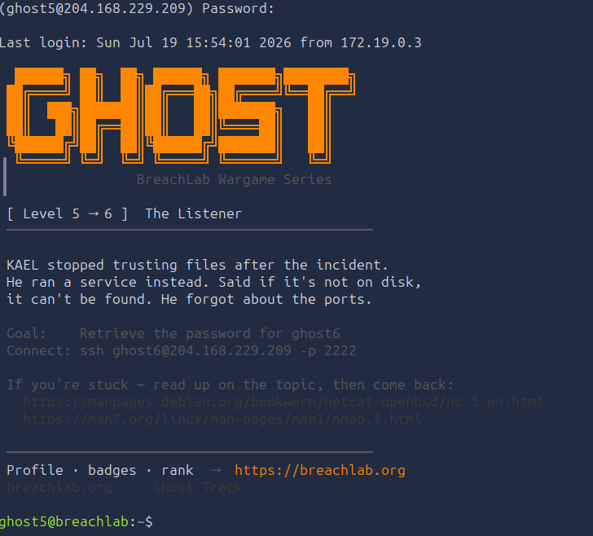

### Step 2:
As usual, scanned through the home directory:

```bash
ls -lRa
```
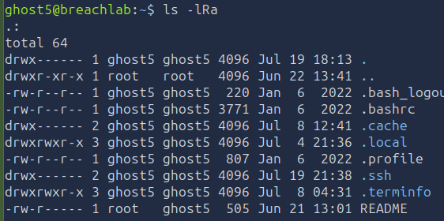

We only have a README in the home directory, so let's check it out.

### Step 3:
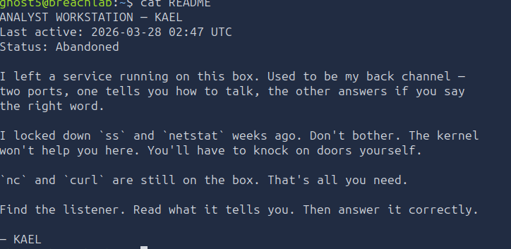

In the file, we find a little explanation telling us that the commands ss and netstat are both 'locked down' (basically we don't have permission to use them)

If we check the permissions we can clearly see we don't have access.
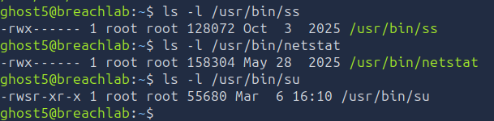

Alright... So how to do this? It says we can use curl and nc, the description of the challenge also has nmap in it... Fine...

However I also want to show a bash native way to do this using sockets.


### Step 4.1:
First, which ports are we talking about, clearly we have two ports to find, so let's do it. For this, we can use nmap to very easily scan those ports, I think it's the easiest way by far. We could also do it with bash, I won't because it's about the same way we could do it with how I am solve the challenge in the fourth part (We'll do it with nmap, netcat, curl and then bash native).

We will add T5 to make a bit faster.

```bash
nmap -T5 127.0.0.1
```
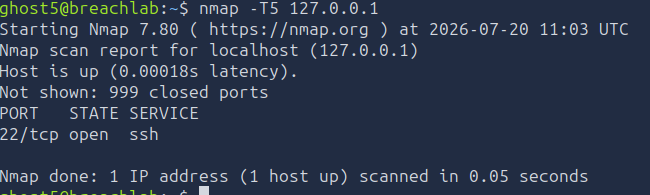

Oh? We only see SSH open... Weird. Why's that?

It's simple... See how it says "999 closed ports"?

In TCP/IP, (See [RFC 6335](https://www.rfc-editor.org/rfc/rfc6335) for more information) ports range from 0 to 65535, this gives us a total of 65536 ports, so why only 1000? That's because the normal implementation of nmap scans only the 1000 most common ports. We can see which ports specifically by enabling debug mode in nmap, this is done by using the `-dd` parameter (However be careful this is EXTREMELY verbose, you will need to pipe it into less in order to not flood your terminal too much). `-ddd` goes further and shows the individual exchanges of the connetions. 

- You can go up to level 9 debug mode but this is WAY overkill.

Anyways... So, how do we find those other ports? Well, we can do a full scan of all ports using the `-p-` parameter, we could use `-p0-`to also scan port 0 but it's not necessary.

```bash
nmap -T5 -p- 127.0.0.1
```

This gives us:
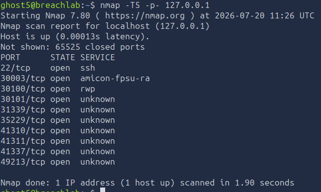

Alright... Now we can see we have quite a few ports... We see a few with unknown services, and others with "known services".

### Step 4.2:
Let's start our checking.

The fastest way to do this is of course with nmap:
```bash
nmap -T5 -p- --script=banner 127.0.0.1
```
This will give us the banner of all open ports on our system.

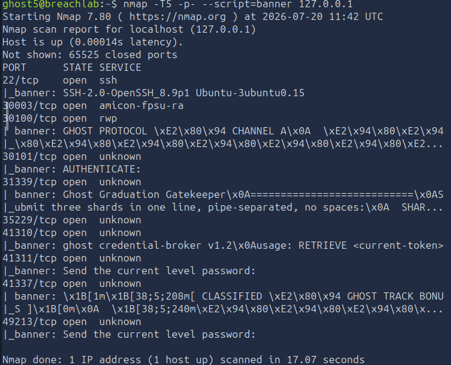

We can see quite a few things, some of them will be seen in later challenges, surprisingly we don't have the banner for port 30003 which we will see in Challenge 19.

Let's go over the ports we do have banners, we se that port 30100 has "CHANNEL A" in it, if we remember, the README did say "Used to be my channel", so let's try and get more information on that one.

### Step 4.31:
For this, we will use netcat (nc).

```bash
nc 127.0.0.1 30100
```
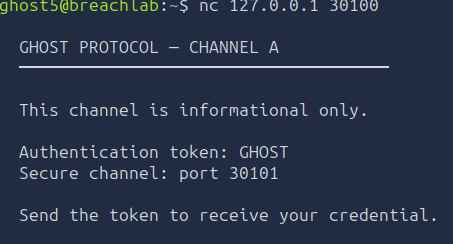

Alright, so... That's pretty cool, we found our port and the token "GHOST" we need with netcat.

### Step 4.32:
Just for demonstration, we can also do it with curl.

Most people forget curl isn't just for HTTP and HTTPS, it is used for dozens of protocoles:

`curl is a tool for transferring data from or to a server using URLs. It supports these protocols: DICT, FILE, FTP, FTPS, GOPHER, GOPHERS, HTTP, HTTPS, IMAP, IMAPS, LDAP, LDAPS, MQTT, MQTTS, POP3, POP3S, RTSP, SCP, SFTP, SMB, SMBS, SMTP, SMTPS, TELNET, TFTP, WS and WSS.`

is the description of the curl man-page after all.

I am sure curl has a lot of ways to do this, but personally I found the fastest was to use HTTP 0.9... It is the first official version of HTTP from 1991, it was a proof of concept, an experiment, no headers, no status codes (404, 200, 500), no versioning in requests, only GET method. For Tim Beners-Lee, calling it 0.1 or 1.0 would have meant it was either barely functional or complete (Which it was neither of), simply put, HTTP 1.0 was the real standard, 0.9 was merely a primitive prototype. 

But it works for our purpose of fetching raw data over TCP:
```bash
curl --http0.9 http://127.0.0.1:30100
```
Curl 7.66.0 and above disallow HTTP 0.9 by default, so you will need to use the `--http0.9` parameter to enable it.
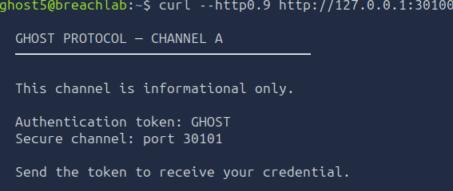

### Step 4.33 [SKIP IF YOU WISH TO NOT SEE BASH NATIVE]:
Alright... Before moving on, I want to demonstrate one last way to do this natively in bash.

In bash, we can use the `/dev/tcp/host/port` file descriptor to use raw network connexions natively using a virtual file on-the-fly in the bash shell itself. This only works with bash implementations that are compiled with the `--enable-net-redirections` parameter.

It also has the advantage of being VERY stealthy compared to traditional tools and it is bash native, no need for external dependencies at all.

Let's create our connection, for this, we will use the `exec` command and assign the file descriptor 3 to our socket, `<>` will be used for reading and writing to our connection:
```bash
exec 3<>/dev/tcp/127.0.0.1/30101
```


After this, we can see if our socket is on with:
```bash
ls -l /proc/self/fd
```
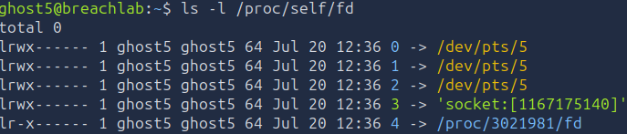

The number in between the brackets is called a socket inode number which just identifies what socket we're using, remember the philosophy:

- "In Linux, Almost everything is treated as a file".

In the context of a socket, a socket inode will contain its metadata, notably:

- The socket's unique numerical ID (the inode number).

- The type of socket (TCP, UDP, or UNIX domain socket).

- The current state (LISTENING, ESTABLISHED, CLOSE_WAIT).

- Pointers to the kernel's internal read/write buffers for that connection.

- And of course, pointers to the local IP/port and the remote IP/port.

We can see those informations in the virtual files `/proc/net/tcp` and `/proc/net/tcp6` for IPv4 and IPv6 respectively in hexadecimal format:

```bash
cat /proc/net/tcp
```
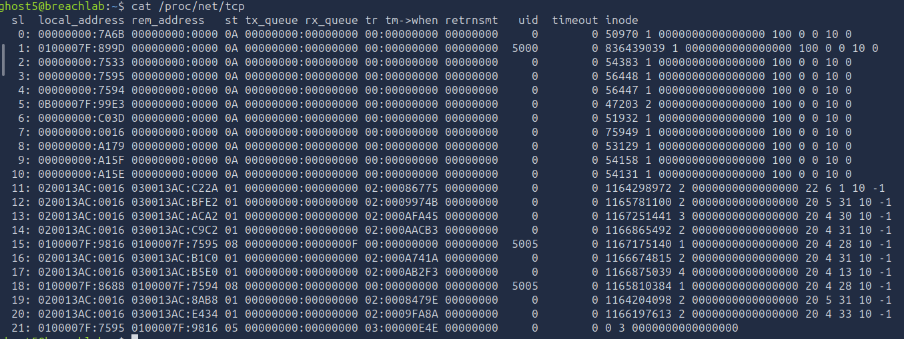

Alright wow, what's all this?

All of this is the informations pertaining to our system's TCP connections.

- sl: Slot number (index in kernel table)
- local_address: Local IP:Port in hexadecimal
- rem_address: Remote IP:Port in hexadecimal
- st: Connection state (Eg: 01 for ESTABLISHED)
- tx_queue: Transmit queue size.
- rx_queue: Request queue size.
- uid: User ID owning this socket.
- inode: Inode number of the socket (can be mapped to processes).

This is particularly important if you wish to understand linux network forensics at a low level.

If you wish to find more information about /proc/net/, you may wish to look at [this](https://man7.org/linux/man-pages/man5/proc_pid_net.5.html) man page.

All of this isn't relevant for our challenge, it's nice to know.

Now we can use cat for reading and echo for writing to our file descriptor:
```bash
cat <&3
```
Now I can see what's the banner for the connection, right?

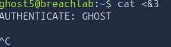

Oh? Why does it not work? I typed in our token "GHOST", yet it doesn't give anything?

That's because, while the connection is indeed writing and reading, our cat doesn't actually do it for us.

A better way to do this is to put the reading process in the background while we write to the connection.

```bash
cat <&3 &
```
and:
```bash
cat >&3
```
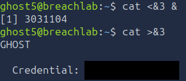

And there we go, we have our credentials!

We can close our connection with:
```bash
exec 3<&-
```

### Step 5:
Moved on to the next level using the password we found.
