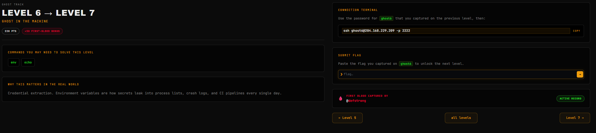
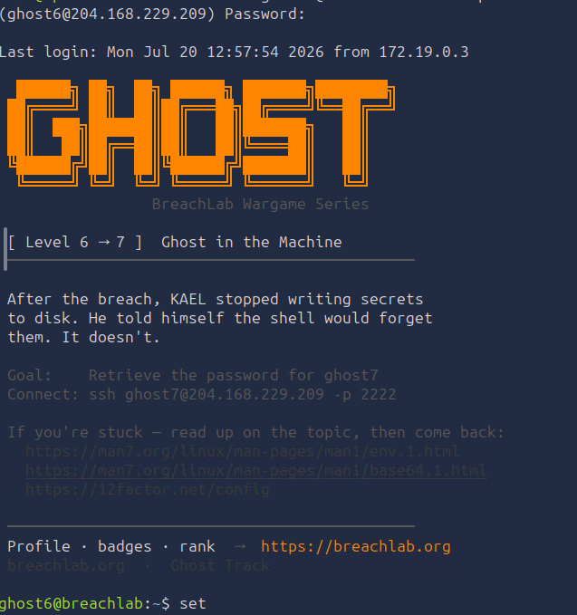
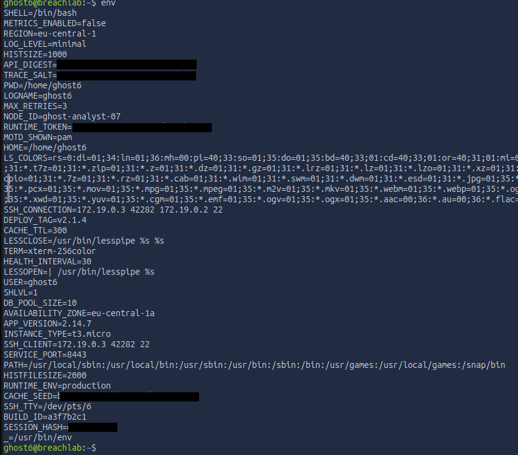
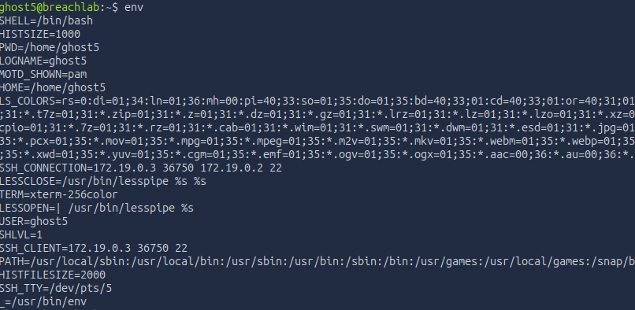
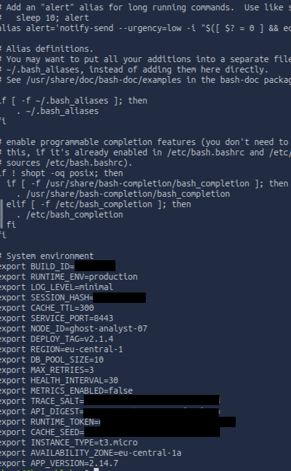
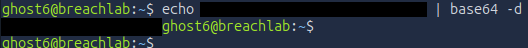
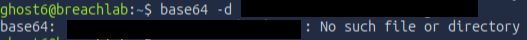

# Level 6 - Ghost in the machine
---
**Category:**  Linux Exploitation

**Points:** 220

**Difficulty:** Beginner+

**Link:** https://breachlab.org/tracks/ghost/6

## 📋 Description:
Credential extraction. Environment variables are how secrets leak into process lists, crash logs, and CI pipelines every single day.


## 🔍 Reconnaissance:
1. Opened the challenge page:


## 🛠️ Tools Used:
- ssh
- env
- echo
- base64

## 🚀 Solution:

### Step 1:
Connected using ssh to the target using the credentials found in Challenge 5:

```bash
ssh ghost6@204.168.229.209 -p 2222
```


### Step 2:
Immediately based off the description, I knew this challenge was about environment variables, so I checked them out:

```bash
env
```


Clearly this is it, we see a few that are interesting, notably:
```bash
API_DIGEST=Mxxxxxxxxxxxxxxxxxxxxxxxxx=
TRACE_SALT=bxxxxxxxxxxxxxxxxxxxxxxxxx3
RUNTIME_TOKEN=cxxxxxxxxxxxxxxxxxxxxxxxxxz
CACHE_SEED=bxxxxxxxxxxxxxxxxxxxxxxxxxs
BUILD_ID=axxxxxxxx1
SESSION_HASH=dxxxxxxxx8
```
Mhhh... But what are those? Where did they come from?

Clearly those are not standard linux environment variables. The answer to this lies in the challenge... If we go on another user for example:



We can clearly see that the environment variables are different, so they are not standard linux environment variables, but rather custom ones.

The most classic way to do this on linux systems is to use the `export` command, which is used to set environment variables. However, this is not the only way to do it, and in fact, the way this challenge is set up, it is not done using the classic `export` command, but rather using a file called `.bashrc` which will inject what we put in it into our environment.

If we cat the file, we can see that indeed, we have it:



This copies the actual behavior of AWS containers. 

Let's go top to bottom:
- `BUILD_ID` is a unique ID usually used to trace which code changes caused a bug.
- `RUNTIME_ENV` represents the environment tier, here it's production, this would be used to change the behavior of the application based on whether it's in staging, development or production.
- `LOG_LEVEL` would be used to control how verbose logs would be, in this case, it would be set at minimal.
- `SESSION_HASH` looks like a session cookie or JWT token but it wouldn't be used as an environment varriable usually.
- `CACHE_TTL` is the time in second of how long the data remains in the cache, this is called the `Time-To-Live` value and is measured in seconds, here it would be 300 seconds.
- `SERVICE_PORT` is pretty self-explanatory, it would be the port the web server is hosted at, here 8443.
- `NODE_ID` is another ID and it would be the specific instace's ID in a cluster.
- `DEPLOY_TAG` is the deployment version identifier, this would be injected by a CI/CD pipeline so that we know which version of the code is running.
- `REGION` is the AWS region identifier (Here it's in Frankfurt, Germany), this would tell the application which AWS region it's running in.
- `DB_POOL_SIZE` is the number of database connections the application will maintain at one time in its connection pool. This is to balance performance in real applications, however here it's meaningless since it's faked.
- `MAX_RETRIES` is probably just a rate-limiting option, here set at 3 to signify how the service should retry in case of a failed network request.
- `HEALTH_INTERVAL` is how long the application checks its own health, this is how seen in case of load balancers or orchestration systems like the famous Kubernetes.
- `METRICS_ENABLED` is a boolean variable that just sets whether or not the application performs performance metric collection, here it's disabled.
- `TRACE_SALT` alright so now we're getting to the good stuff, this is a copy of a fake monitoring key, stuff like Datadog would use this as an API key of sorts, it's just a decoy of course.
- `API_DIGEST` this of course is an API key, it's also why the description of the challenge says secrets leak. It's usually the number 1 thing attackers look for.
- `RUNTIME_TOKEN` is a fake JWT looking token, it simulates traditional microservice tokens that would be used to authenticate with other microservices.
- `CACHE_SEED` is interesting if you decode it... It's funny. Have fun.
- `INSTANCE_TYPE` is the AWS EC2 instance size, t3.micro is the free-tier for instances. It's exactly what you would find a real deployment.
- `AVAILABILTIY_ZONE` is pretty self-explanatory, it's used for fault tolerance in order to know where to place ressources in AWS cloud.
- `APP_VERSION` finally, is the application version number, you might ask how it differs from the deployment version, and that's to represent semantic versioning of the software itself.

With all of that explained, let's decode our password.

### Step 3:
Based on the format of the variable that gives us the password, it is clear it is `basexx` encoding. As such we will use the `basexx` command to decode it. But how do we input it into the command?

Maybe like this?

```bash
basexx -d xxxxxxxxxxxxxxxxxx
```



It doesn't work... Why is that? Well. It's simple.

It's because if we actually properly read the [manual](https://linux.die.net/man/1/base64) of `basexx` it wants a FILE, yet we give it a STRING. Always remember:

- "RTFM".

Now, remember the challenge "Tools you will use", it included echo, why? Because we can pipe the output of echo into `basexx` (standard input).

```bash
echo xxxxxxxxxxxxxxxxxx | basexx -d
```


And THAT is how we get the credential for the next challenge.

Note: We could have also used a file, put the string into the file using:

```bash
echo [string] > [file_name]
```
and then decoding the file with basexx -d but still, it's faster the first way.

### Step 4:
Moved on to the next level using the password in one of the files.