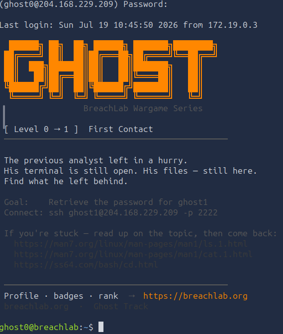
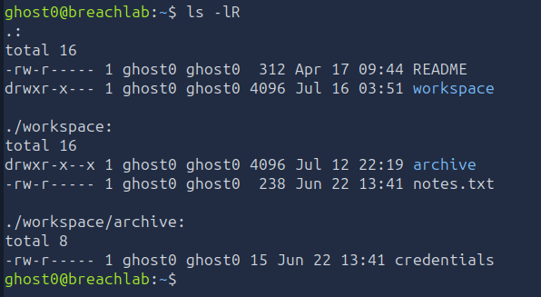
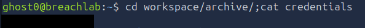

# Level 0 - First Contact
---
**Category:**  Linux Exploitation
**Points:** 100
**Difficulty:** Beginner-
**Link:** https://breachlab.org/tracks/ghost/i/0

## 📋 Description:
Getting your bearings on a box you have never seen before. Every single engagement - offensive or defensive - starts here.

## 📚 What you'll learn:
- Advanced SSH.
- The `ls` utility.
- The `cat` command.
- How to move through your filesystem in CLI.

## 🔍 Reconnaissance:
1. Opened the challenge page  


## 🛠️ Tools Used:
- ssh
- ls
- cd
- cat

## 🚀 Solution:

### Step 0.5 [THIS CAN BE SAFELY SKIPPED IF YOU ALREADY UNDERSTAND THESE CONCEPTS]:
Firstly, let's introduce the commands we will be using for this solution:

In short, `SSH` is a secure cryptographic network protocol used for remote administration of machines, it means `Secure Shell`. Historically, it was used to replace Telnet that was used to communicate with virtual terminals, `TELNET` historically has two meaning: In 1972, in its early versions, it meant `Telecommunications Network`, another meaning, in 2015 was `Teletype Over Network`.

In modern systems, `OpenSSH`, developped by OpenBSD, is the software package that consists of several core programs and tools, those include:
- `sshd`: The daemon that acts as the SSH Server.
- `ssh`: The SSH client used in this challenge to connect to the machine.
- `scp`: A secure file copy utility the send files over the network securely.
- `sftp`: A secure version of the `File Transfer Protocol` using SSH.
- `ssh-keygen`: A utility to generate, manage and convert authentication keys.

Those are the most used ones, there are many others tho.

As mentioned, the command we will use for this is gonna be `ssh`.

Let's introduce the best parameters of `ssh`:
- `-D <your-address>:<your-port>`: This uses a local port, this is mostly used for lateral movement and pivoting in systems. It uses `SOCKS5` protocol, this option requires root for privileged ports (Below 1024).
- `F <your-config-file-path>`: This can be used to use a specific ssh configuration file. Normally, ssh uses the system-wide configuration in `/etc/ssh/ssh_config`, this will be ignored with this parameter, without a path, this option will use the configuration in `~/.ssh/config`, if the option is set to `none`, no configuration will be used.
- `-i <your-private-key-path>`: This option is used to specify a private key to use for authentication. This type of key can be generated with `ssh-keygen`, and is used to authenticate with a public key, this is the most secure native way to authenticate with ssh. (Besides 2FA, which is not native to ssh). The public key is usually stored in `~/.ssh/authorized_keys` on the server, and the private key is stored on the client in ~/.ssh/id_rsa.
- `-J <user>@<jump-host>`: This option is used to connect to a jump host, this is a host that is used as a proxy to connect to another host. This option requires OpenSSH 7.3 or higher.
- `-L <local-port>:<remote-host>:<remote-port>`: This option is used to forward a local port to a remote host and port. This option requires root for privileged ports (Below 1024).
- `-R <remote-port>:<local-host>:<local-port>`: This option is used to forward a remote port to a local host and port. This option requires root for privileged ports (Below 1024).
- `-p <port>`: This option is used to specify the port to connect to on the remote host. The default is 22, but this can be changed by the server administrator.

This is all for the ssh command, there are many more options, but those are the most used ones.

Now, let's introduce the `ls` command, this command is used to list the contents of a directory. It is one of the most used commands in Linux, and is used to enumerate the filesystem, its meaning is "list".

Let's introduce the most used parameters of `ls`:
- `-l`: This option is used to list the contents of a directory in long format, this will show the permissions, owner, group, size, and modification time of each file.
- `-a`: This option is used to list all files, including hidden files (those that start with a dot).
- `-R`: This option is used to list the contents of a directory recursively, this will list the contents of all subdirectories as well.
- `-h`: This option is used to show the sizes of files in human-readable format, this will show the sizes in KB, MB, GB, etc.
- `-S`: This option is used to sort the contents of a directory by size, this will show the largest files first.
- `-t`: This option is used to sort the contents of a directory by modification time, this will show the most recently modified files first.
- `-r`: This option is used to reverse the order of the sort, this will show the smallest files first, or the oldest files first.
- `-1`: This option is used to list the contents of a directory in a single column, this is useful for piping the output to other commands.
- `-F`: This option is used to append a character to the end of each file name to indicate the type of file, this will show a `/` for directories, a `*` for executables, and a `@` for symbolic links.
- `-d`: This option is used to list a directory itself, usually paired with `-l` to get the directory's permissions.
- `-i`: This option is used to show the inode number of each file, this is useful for finding hard links.
- `-n`: This option is the same as `-l` but shows the numeric user and group IDs instead of the names, this is useful for finding files owned by a specific user or group.

This is all for the ls command, there are many more options, but those are the most useful ones. They can be combined to get the desired output, for example, `ls -lah` will show all files in long format with human-readable sizes.

Now, let's introduce the `cat` command, this command is used to concatenate and display the contents of files. It is one of the most used commands in Linux, and is used to read files, its meaning is "concatenate".

The most used parameters of `cat` are:
- `-n`: This option is used to number the lines of the output, this is useful for reading files with line numbers.
- `-b`: This option is used to number the non-empty lines of the output, this is useful for reading files with line numbers, but ignoring empty lines.
- `-s`: This option is used to squeeze multiple adjacent empty lines into a single empty line, this is useful for reading files with many empty lines.
- `-E`: This option is used to show a `$` at the end of each line, this is useful for reading files with trailing whitespace.
- `-T`: This option is used to show tabs as `^I`, this is useful for reading files with tabs.
- `-A`: Equivalent to `-vET`, 
- `-v`: This option is used to show non-printing characters, this is useful for reading files with non-printing characters.


Now, let's introduce the `cd` command, this command is used to change the current working directory. It is one of the most used commands in Linux, is an internal command, native to Linux, and is used to navigate the filesystem, its meaning is "change directory".

```bash
cd /
```
Would move your position in the Linux Filesystem to its root.

To move up a level in the Linux Filesystem, you would use:
```bash
cd ..
```

To move back to where you were previously, you would use:
```bash
cd -
```

To go to your home directory, you can use tilde:
```bash
cd ~
```

This is for the basic syntax, now for file paths, there are two types of file paths in linux, **relative** and **absolute** paths:
- **relative path**: A relative path is a path that is seen from your point of view, for example, if you were on a tree, and you wanted to go to the branch across from you, you would just walk or jump to it.
- **absolute path**: An absolute path is a path that is seen from the point of view of the tree, to retake the tree analogy, imagine you were on a branch and you wanted to go the branch across from you, if you used the absolute path to that branch, you would need to jump down to the root of the tree before climbing back up all the branches needed to reach that branch.

Let's demonstrate practically, let's say we have:
- Root
   - Branch A
      - Sub Branch A
   - Branch B
      - Sub Branch B 

If I was on Sub Branch B and I wanted to go the Sub Branch A with a relative path, I would go Sub Branch B -> Branch B -> Branch A -> Sub Branch A, right?

But if I had to use an **absolute** path, I would have to jump to the root and then go to Sub Branch A; Sub Branch B -> Root -> Branch A -> Sub Branch A.

Well, same in Linux.

For:
- /
   - /home
      - /home/guy
         - /home/guy/Desktop (**You are here**)
         - /home/guy/Documents
         - /home/guy/...
   - /etc

If I wanted to go to my Documents folder, I could do:
```bash
cd ../Documents
```

Or, "Go up one branch and go to Documents".

Now, if I wanted to go to `/etc`, it would be long to use a relative path (`../../../etc`, or go up 3 branches and then go to `/etc`)

That's why here we use absolute path:
```bash
cd /etc
```

Or, "Go from the root to the /etc directory".

With that said and done, let's move to the challenge.

### Step 1:
Connected using ssh to the target using the provided credentials:

```bash
ssh ghost0@204.168.229.209 -p 2222
```


### Step 2:
We first scan through the home directory:

```bash
ls -lRa
```


### Step 3:
Found credentials.txt and opened it to find the password:

```bash
cd workspace/archive;cat credentials.txt
```


### Step 4:
Moved on to the next level using the found password.