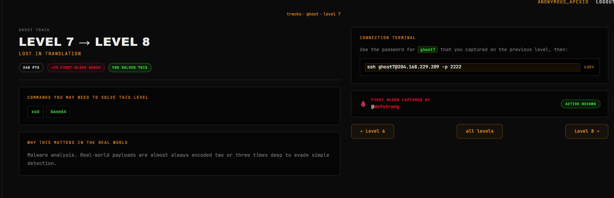
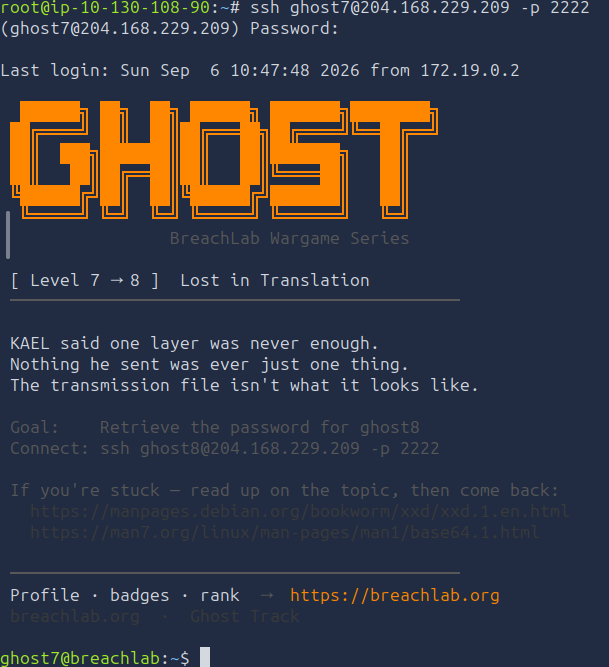
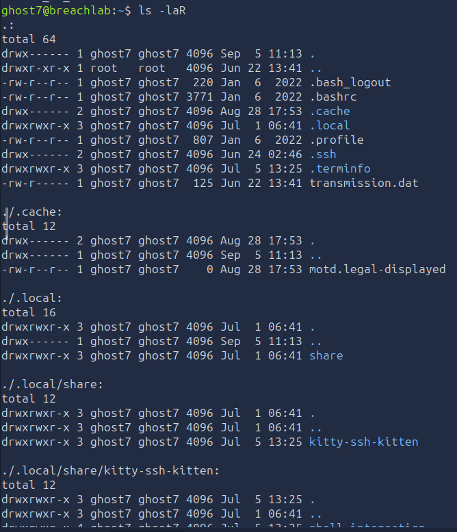
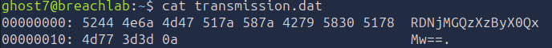
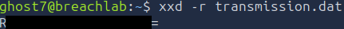
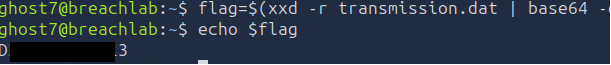

# Level 7 - Lost in translation
---
**Category:** Linux Exploitation

**Points:** 240

**Difficulty:** Beginner+

**Link:** https://breachlab.org/tracks/ghost/i/7

## 📋 Description:
Malware analysis. Real-world payloads are almost always encoded two or three times deep to evade simple detection.

## 📚 What you'll learn:
- The basics of base64.
- The `xxd` utility.
- Understanding an hexdump.

## 🔍 Reconnaissance:
1. Opened the challenge page:  


## 🛠️ Tools Used:
- ssh
- base64
- xxd

## 🚀 Solution:

### Step 1:
Connected using ssh to the target using the credentials found in Challenge 0:

```bash
ssh ghost7@204.168.229.209 -p 2222
```


### Step 2:
Scanned through the home directory as usual:

```bash
ls -lRa
```


We only have one file that is related to the challenge here: `transmission.dat`.

### Step 3:
Let's check our file!

```bash
cat transmission.dat
```


Alright, what's going on here? So immediately we have 3 parts that pop-up right? Offset number, `hexadecimal` representation of the data and the data itself in ASCII. This is what we call an `hexdump`, the `ASCII` is optional usually.

The format in the file is usually given by the command `xxd` which is what we will see below.

### Step 3.1 [Skippable]:
The `xxd` utility is a utility used to create an hexdump of a file (or reverse it), the utility is part of of the `vim-common` text editor's package on most common distributions except on Debian based distributions where it is split into its own standalone package.

The best xxd parameters are:
- `-p`: Output is plain hexdump, no offsets or ASCII representation.
- `-r`: From an xxd output, reverses the operation, convert hexdump back to ASCII.
- `-c`: Changes the number of bytes per line, default is 16
- `-b`: Switches to bits dump rather than hexdump.
- `-i`: Output in C `include` file style, nice to get the data into a program with the format `0xAA`.
- `-g`: Changes the number of bytes per group, default is 2.
- `-u`: Switches to uppercase hex letters rather than lowercase. Can be useful in scripts.

### Step 4:
With that said, let's now output the file in a usable format:
```bash
xxd -r transmission.dat
```


We can see that indeed, we have reversed the hexdump.

The output is base64. What is base64 you might ask? Well let's see.

### Step 4.1 [SKIPPABLE]:
`Base 64` is a group of binary to text encoding schemes that represent binary data in an ASCII format by translating it into a `radix 64` (Which just means it uses 64 characters) representation. The term Base64 was coined from a specific MIME content transfer encoding.

Each caracter can be represented by 6 bits, hence 64 possibilities (but 65 characters), which means that 4 characters represent 3 bytes. The principle of the encoding is to take 3 bytes (24 bits) and divide them into 4 groups of 6 bits. Each group of 6 bits is then converted into a corresponding ASCII character according to the Base64 table.

The base 64 table regex is as follows:
```
A-Za-z0-9+/
```

The `=` character is used as a padding character to ensure that the length of the encoded string is a multiple of 4.

The full explanation of the base64 encoding can be found on the RFC page:
- [RFC 4648](https://datatracker.ietf.org/doc/html/rfc4648#section-4)

The `base64` utility is a utility used to encode and decode data in base64 format. The utility is part of the `coreutils` package on most common distributions.

It's the tool we will be using for this challenge.

Here is the parameters of the `base64` utility:
- `-w`: Wrap encoded lines after COLS character (default 76). Use 0 to disable line wrapping.
- `-d`: Decode the input data.
- `-i`: Ignore non-alphabet characters in the input data.

### Step 4.2:
Let's decode the base64 data:
```bash
flag=$(xxd -r transmission.dat | base64 -d)
```


### Step 5:
Moved on to the next level using the password in one of the files.

