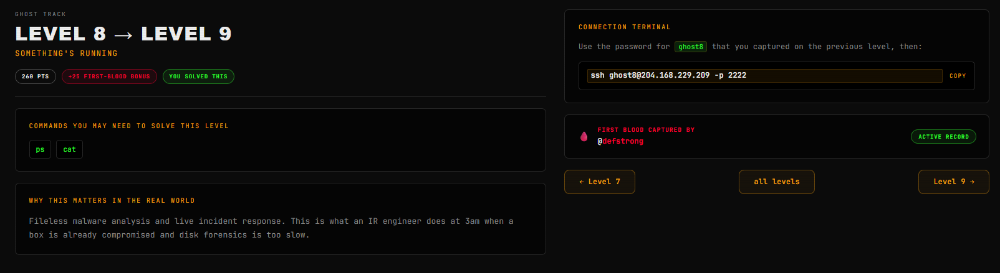
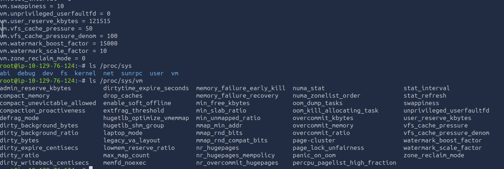
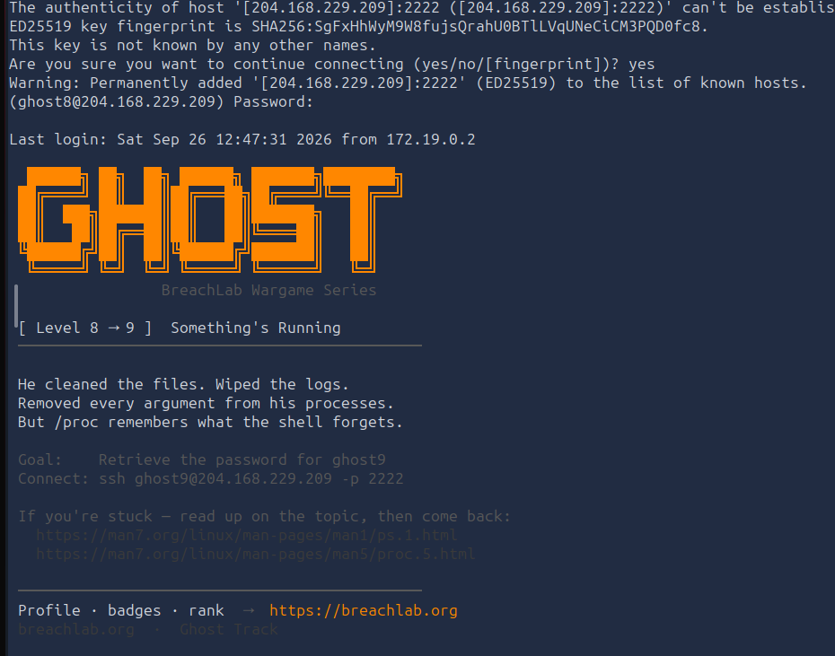
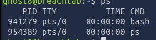
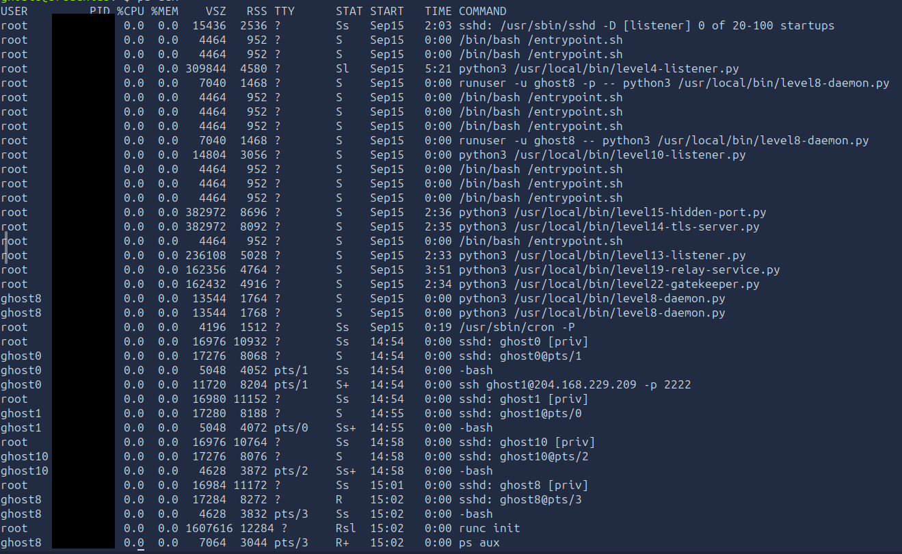
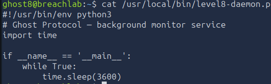
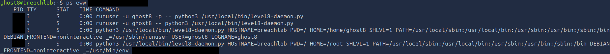
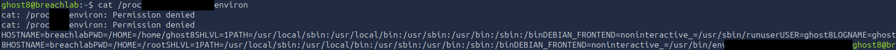

# Level 8 - Something's Running
---
**Category:**  Linux Exploitation
**Points:** 260
**Difficulty:** Medium-
**Link:** https://breachlab.org/tracks/ghost/i/8

## 📋 Description:
Fileless malware analysis and live incident response. This is what an IR engineer does at 3am when a box is already compromised and disk forensics is too slow.


## 🔍 Reconnaissance:
1. Opened the challenge page:  


## 🛠️ Tools Used:
- ssh
- ps
- cat

## 🚀 Solution:

### Step 0.5 [THIS CAN BE SAFELY SKIPPED IF YOU ALREADY UNDERSTAND THESE CONCEPTS]:
Before proceeding, let's introduce the concepts of `Fileless Malware` and `Live Incident Response`.

A `Fileless Malware` is a type of malware that does not rely on files to infect a system, but rather uses legitimate tools and processes to execute its payload. This makes it harder to detect and remove, as it does not leave behind traditional file based indicators of compromise.

`Live IR` is the process, part of DFIR, of investigating and responding to security incidents on a live system, without shutting it down or taking it offline. This is often necessary when dealing with fileless malware, as traditional forensic techniques may not be effective.

This challenge has two valid paths in order to solve it, one, of course, faster than the other.

Before we go over the solution, let's introduce the topics shown here:
- Processes.
- The `/proc` directory

We will first start with processes.

### Step 0.6
What is a process?

In linux systems, a process is defined as an instance of a program loaded into memory, a collection of ressources. It is defined by multiple components, notably:
- Its **PID**, process ID, a unique non-negative integer that is assigned when the process is created using the `fork()` syscall. PID's type is `pid_t`and is defined in `<sys/types.h>`.
- Its **PPID**, parent process ID, the proces ID that identifies the process's parent which created that process using `fork()`.
- The **process GID** and **SID**, process groups and sessions are defined as abstractions. A process group is a collection of processes that share the same process GID. For example `ls | grep` are placed in the same process group. A session is a collection of processes that share the same SID. All members of a process group also have the same SID. A new session is created when `setsid()` is called by a process which creates a new session whose session ID is the same as the PID of the process that called `setsid()`. The creator of the session is called the `session leader`, and by extension, the `process group Leader` for that group.
- One or more **UID** and **GID**. Each process has associated user and group IDs. They're integers and defined as `uid_t` and `gid_t`, each process has a Real UID and a real GID, those determine who is the owner of that process, they also have an Effective UID and GID, those are used by the kernel to determine the permissions that process will have when accessing ressources. A few more UID and GIDs are used, notably saved set-UID and set-GIDs, filesystem related IDs and supplementary group IDs, read `credentials(7)` in the man-pages for more information.
- The **process state**, which is a single character that represents the current state of the process. The possible states are:
  - `R` -- Running
  - `S` -- Sleeping
  - `D` -- Uninterruptible sleep
  - `Z` -- Zombie
  - `T` -- Stopped
  - `t` -- Tracing stop (By debugger)
  - `X` -- Dead (should never be seen)
  - `I` -- Idle
- The **process name**, which is a string that represents the name of the process. It is usually the name of the executable file that was used to create the process.
- The **process command line**, which is a string that represents the command line arguments that were used to create the process. It is usually the same as the process name.
- The **process environment**, which is a set of key-value pairs that represent the environment variables that were used to create the process. It is usually the same as the process command line.
- The **process open files**, which is a set of file descriptors that represent the files that were opened by the process.
- The **process memory**, which is a set of memory regions that represent the memory that was allocated by the process.
- The **process signals**, which is a set of signals that represent the signals that were sent to the process.
- The **process capabilities**, which is a set of capabilities that represent the capabilities that were granted to the process.


### Step 0.75 [Extremely in-depth, may be skipped if you already understand these concepts]:
Now, let's introduce the `/proc` directory.

Let's ask the big question: **What even is `/proc`?**

The `/proc` filesystem is an in-memory virtual filesystem (VFS) that presents kernel data structures as hierarchal directory and file trees, following the philosophy that "In Linux, everything is a file.", it doesn't survive the machine's reboot, yet it still very much interacts with syscalls like `open()` and common file access commands like cat and grep, this is because of a pseudo file system, it's basically a software interface linked to the data structures living in the linux kernel.

This entire concept came originally from Unix V8, it originally was a very rudimentary looking concept, a single file per process that used the `ioctl()` syscall for debugging, the philosophy came from the Plan 9 OS, the successor to Unix back in the 1992, in it, **everything** truly was a file, Linus integrated `procfs` into the kernel in 1992, under the version 0.97.3, with much much more functionality than what Plan 9 had, a process visualiser disguised as a file tree. By the very nature of this file system, most files are emulated, meaning they're all at 0 size by default, if you check `/proc/cpuinfo`, `cat` will output tons of data from it, yet if you check it with `ls -l` or `stat`, you will see that its size is 0, this means it generated every output on-the-fly. Those are called `virtual files`.

Another peculiar file in the VFS is /proc/kcore, a file with a reported size of a whole **128 Tebibytes** (Or 140 Terabytes) of data in it, isn't THAT particularly interesting? The reason for this is because this number:
`140 737 471 594 496`

Now you might wonder, why that particular number? Because `/proc/kcore` is the literal kernel's virtual addres space! It maps directly to the system's core memory structure! And if you remember from your computer science classes, if you have ever had any, 64 bit CPUs actually **only** use 48 bit for virtual memory space! And in linux, that space is divided into two! User Space and Kernel Space! And ladies and gentlemen, may I ask, what is the answer to **2^48** ? Exact! `281 474 976 710 656`, 281 Terabytes of data! Divided in two gives us just what we need for our 140 Terabytes above! (And a bit less because of a 16 Mo depecrancy cause null pointers and stuff but that's advanced and outside the scope of this level).

Anyhow, this is just one of the many files under /proc! Let's actually delve into the meat.

The /proc filesystem looks like this:
```
/proc
└── 📁1
... (Other PID directories)
└── 📁acpi:
└── bootconfig
└── buddyinfo
└── 📁bus
└── cgroups
└── cmdline
└── consoles
└── cpuinfo
└── crypto
└── devices
└── diskstats
└── dma
└── 📁driver
└── 📁dynamic_debug
└── execdomains
└── fb
└── filesystems
└── 📁fs
└── interrupts
└── iomem
└── ioports
└── 📁irq
└── kallsyms
└── kcore
└── key-users
└── keys
└── kmsg
└── kpagecgroup
└── kpagecount
└── kpageflags
└── latency_stats
└── loadavg
└── locks
└── mdstat
└── meminfo
└── misc
└── 📁mounts -> self/mounts
└── mtrr
└── 📁net -> self/net
└── pagetypeinfo
└── partitions
└── 📁pressure
└── schedstat
└── 📁scsi 
└── 📁self -> $$
└── slabinfo
└── softirqs
└── stat
└── swaps
└── 📁sys
└── sysrq-trigger
└── 📁sysvipc
└── thread-self -> $$/task/$$
└── timer_list
└── 📁tty
└── uptime
└── version
└── version_signature
└── vmallocinfo
└── vmstat
└── zoneinfo
```

As we can see, there are two types of directories under /proc:
- The first type is the directories named after numbers, those are the process directories, each directory is named after the PID of the process it represents. Inside each directory, there are files that represent the various attributes of the process, such as its command line, environment variables, open files, and memory mappings.
- The second type is the directories named after keywords, those are the system directories, they represent various aspects of the system, such as the CPU, memory, and network interfaces. Inside each directory, there are files that represent the various attributes of the system, such as its configuration, status, and statistics.

Let's go over the most **important files** in the process directories:  

**/proc/cpuinfo**:  
This file contains information about the CPU, such as its model, speed, and cache size, it contains one block for each logical core, and each block contains the following fields:
  - `processor`: The logical core number, starting from 0.
  - `vendor_id`: The CPU vendor, such as `GenuineIntel` or `AuthenticAMD`.
  - `cpu family`: The CPU family number, which is a unique identifier for the CPU architecture.
  - `model`: The CPU model number, which is a unique identifier for the CPU microarchitecture.
  - `model name`: The CPU model name, which is a human-readable string that describes the CPU's stats.
  - `stepping`: The CPU stepping number, which is a unique hexadecimal identifier for the CPU revision.
  - `microcode`: The CPU microcode version, which is a unique identifier for the CPU firmware.
  - `cpu MHz`: The CPU clock speed in megahertz, it's the local frequency of the processor.
  - `cache size`: The size of the cache in kilobytes (Most often L2/L3).
  - `physical id`: The physical package ID of the CPU, which is a unique identifier for the physical CPU socket, it identifies the physical socket.
  - `siblings`: The number of logical cores in the socket.
  - `core id`: The core ID of the logical core, which is a unique identifier for the logical core within the physical package.
  - `cpu cores`: The number of physical cores in the physical package.
  - `apicid`: The APIC ID of the logical core, which is a unique identifier for the logical core within the APIC system.
  - `initial apicid`: The initial APIC ID of the logical core, which is a unique identifier for the logical core within the APIC system at boot time.
  - `fpu`: Whether the logical core has a floating-point unit (FPU) or not.
  - `fpu_exception`: Whether the logical core has a floating-point exception handler or not.
  - `cpuid level`: The CPUID level of the logical core, which is a unique identifier for the logical core within the CPUID system.
  - `wp`: Whether the logical core has write protection (WP) or not.
  - `flags`: The CPU flags of the logical core, which is a set of features and capabilities that the logical core supports, such as SSE, AVX, and Hyper-Threading.
  - `bugs`: The CPU bugs of the logical core, which is a set of known vulnerabilities and issues that affect the logical core, such as Spectre and Meltdown.
  - `bogomips`: The BogoMIPS value of the logical core, which is a measure of the CPU's performance and speed, it's a rough estimate of the number of million instructions per second (MIPS) that the logical core can execute.
  - `clflush size`: The cache line size of the logical core, which is the size of the cache line in bytes, it's the smallest unit of data that can be transferred between the CPU and the cache.
  - `cache alignment`: The cache alignment of the logical core, which is the alignment of the cache lines in bytes, it's the boundary on which the cache lines are aligned.
  - `address sizes`: The address sizes of the logical core, which is the number of bits used for physical and virtual addresses, it's the maximum amount of memory that the logical core can address. (Most often 46 bits for logical and 48 bits for physical)
  - `power management`: The power management features of the logical core, which is a set of features and capabilities that allow the logical core to manage its power consumption and performance, such as frequency scaling and sleep states.

The `flags` field is particularly interesting, a few common flags are `vmx/svm` (Intel/AMD Virtualisation), `aes` (AES acceleration), sse/avx/avx2 (Vectorial instructions), `pae` (Allows to us more than 4 GB of RAM, up to 64), `lm` (64 bit mode), `hypervisor` (indicates that you're being virtualized).

The `lscpu` command uses this file.

**/proc/meminfo**:  
This file shows a detailed overview of the memory, one line for one metric (Values are in KB). There are a LOT of lines in it and I am not gonna go over all of them, but just so you get the idea, here are the important ones:
- `MemTotal`: The total physical memory that is usable.
- `MemFree`: The strictly unused memory.
- `MemAvailable`: An estimate of the available memory for new applications (Includes cache).
- `Buffers`: Block metadata cache size.
- `Cached`: Page cache.
- `SwapTotal`/`SwapFree`: Total size and available size in the swap. Often max for both unless your computer lacks memory.
- `Dirty`: Size of pages waiting to be written to the disk.
- `Writeback`: Size of pages currently being written.
- `Slab`: Memory used by kernel's internal structures.
- `AnonPages`: Anonymous memory (The stack, the heap, etc...)

Utilities like `free` (Used to display available and used memory on the system) actually exploit this file for data collection.

**/proc/uptime**:  
This file has two numbers. That's it. Funny right? And they're on one line. The **first** is the time since the last start of the system, the **second** is the time of inactivity for all CPU cores.

For example: 6779.65 12356.19

**/proc/loadavg**:  
This file gives 5 numbers; the average load of the system in 1, 5 and 15 minutes, the number of executable processes / the total number of tasks and finally the PID of the last created process (Which will most always be the process of the `cat` command if you view it with `cat`).

Example:
```bash
0.20 0.21 0.14 5/486 164622
```

The `uptime` command uses this file.

**/proc/version**:  
This file gives you a detailed output of the system's architecture, kernel version, compiler, build date and such.

On another note, this isn't used by the `uname` command. That command uses the informations under `/proc/sys/kernel` which we will explore later.

Example:
```bash
Linux version 6.17.0-1012-aws (buildd@lcy02-amd64-093) (x86_64-linux-gnu-gcc-13 (Ubuntu 13.3.0-6ubuntu2~24.04.1) 13.3.0, GNU ld (GNU Binutils for Ubuntu) 2.42) #12~24.04.1-Ubuntu SMP Mon Apr  6 17:36:28 UTC 2026
```

**/proc/cmdline**:  
This file gives us the parameters used to build the running kernel of the system in one line.

Example:
```bash
BOOT_IMAGE=/vmlinuz-6.17.0-1012-aws root=PARTUUID=300815f3-e68b-44d8-b370-692f3fbf90f7 ro console=tty1 console=ttyS0 nvme_core.io_timeout=4294967295 panic=-1
```

**/proc/modules**:  
Lists all kernel modules currently loaded, each line follows the following format:  
```bash
name size use_number [dependant_modules] status address
```

Example:
```bash
x_tables 65536 8 xt_nat,xt_tcpudp,xt_conntrack,xt_MASQUERADE,xt_set,xt_addrtype,nft_compat,ip_tables, Live 0xffffffffc0407000
```
This file is used by the formatting command `lsmod`.

**/proc/filesystems**:  
Shows the filesystems that the kernel knows.

Example:
```bash
nodev	sysfs
...
nodev	devpts
	    ext3
    	ext2
    	ext4
```
The ones prefixed by `nodev` means they don't need a peripheral to function (Like sysfs or proc).

**/proc/partitions**:  
Lists the storage peripherals and the known partitions in 4 columns:
```bash
major minor  #blocks  name

   7        0      28876 loop0
   7        1      62248 loop1
   7        2          4 loop2
   7        3      75292 loop3
   7        4      21900 loop4
   7        5      75756 loop5
   7        6      55480 loop6
   7        7      50444 loop7
 259        0    1048576 nvme1n1
 259        1   31457280 nvme0n1
 259        2   30407663 nvme0n1p1
 259        3       4096 nvme0n1p14
 259        4     108544 nvme0n1p15
 259        5     934912 nvme0n1p16
   7        8      68408 loop8
```

**/proc/mounts**:  
This shows the mounted filesystems, it is a symlink to `/proc/self/mounts` which is a symlink to `/proc/<PID>/mounts` where `<PID>` is the PID of the process that is reading the file, in this case, `cat`. This means that if you read `/proc/mounts` from a process that has a different mount namespace than the init process, you will see a different list of mounts.

Each line follows the format:
```bash
peripheral mount_point fs_type options dump passno
```

Example:
```bash
127.0.0.1:/ /opt nfs4 rw,relatime,vers=4.1,rsize=1048576,wsize=1048576,namlen=255,hard,noresvport,fatal_neterrors=none,proto=tcp,port=20907,timeo=600,retrans=2,sec=sys,clientaddr=127.0.0.1,local_lock=none,addr=127.0.0.1 0 0
```

This file is used by the `mount` command.

**/proc/swaps**:  
Shows the active swap files with their type (Either `partition` or `file`), their size and their use:
```bash
Filename				Type		Size		Used		Priority
/swapfile       file		1048572		 0		-2
```

This file is used by the `swapon` command, using the -s option will give this exact output.

**/proc/stat**:  
This **important** file shows all system counters since the kernel's start, its the principal source for tools like `top`.

There are a few rows in this file, I'll focus on the most important one.

The `cpu` row (and its cores, cpu0, cpu1...), give the time that passed for each state, this is stated in jiffies, equivalent to 0.01 seconds.

*Note: Jiffies are calculated based on `CLK_TCK` constant, this can be found using the `getconf CLK_TLK` command, it's usually 100 in user-space to maintain compatibility.*

The format of the cpu timers is:  
```bash
cpu  user nice system idle iowait irq softirq steal guest guest_nice
```
- `user`: User-space timer.
- `nice`: User-space timer for "niced" processes.
- `system`: Kernel-space timer.
- `idle`: Inactivity timer.
- `iowait`: I/O Timer.
- `irq` and `softirq`: Hardware and Software Interruptions.
- `steal`: Hypervisor stolen timer.

The other rows in this file are:  
- `intr`: The number of hardware interruptions. (More informations related to this can be found in **/proc/interrupts**)
- `ctxt`: The number of context changes.
- `btime`: Unix-Time format since last boot.
- `processes`: Total number of created processes since boot.
- `procs_running`: Self explanatory, processes currently running on the CPU.
- `procs_blocked`: Number of processes waiting for I/O to finish.

**/proc/vmstat**:  
Detailed counters related the the virtual memory subsystem, there are tons, I'll just list the important ones:
- pages I/O (`pgpin`, `pgpout`)
- page faults (`pgfault`, `pgmajfault`)
- swap activity (`pswpin`, `pswpout`)

This file is particularly useful to do in-depth memory pression diagnosis but this is WAY outside of this challenge.

**/proc/diskstats**:  
Detailed statistics on the I/O operations of the block devices on the system:
```bash
 259       1 nvme0n1 84511 43290 2483785 95469 17853 46335 1536300 23450 0 79523 118919 0 0 0 0 0 0
```
The number of read/write operations, the transfered sectors, the time passed between I/O.

This file is used by the `iostat` command.


**/proc/interrupts**:  
As previously mentioned, this gives an more in-depth look into the statistics related to interruptions, line by line and one column by core. The last one is the controler and the associated peripheral.

Example:
```bash
           CPU0       CPU1       
  1:         10          0  IO-APIC   1-edge      i8042
  4:       1633          0  IO-APIC   4-edge      ttyS0
  8:          0          0  IO-APIC   8-edge      rtc0
  9:          0          0  IO-APIC   9-fasteoi   acpi
 12:          1        153  IO-APIC  12-edge      i8042
 24:         41         26 PCI-MSIX-0000:00:1f.0   0-edge      nvme1q0
...
NMI:          0          0   Non-maskable interrupts
LOC:    7895481    7878905   Local timer interrupts
SPU:          0          0   Spurious interrupts
PMI:          0          0   Performance monitoring interrupts
IWI:     833947     849161   IRQ work interrupts
RTR:          0          0   APIC ICR read retries
RES:     524904     524026   Rescheduling interrupts
CAL:    2682021    2677472   Function call interrupts
TLB:      67965      67629   TLB shootdowns
TRM:          0          0   Thermal event interrupts
THR:          0          0   Threshold APIC interrupts
DFR:          0          0   Deferred Error APIC interrupts
MCE:          0          0   Machine check exceptions
MCP:         45         45   Machine check polls
ERR:          0
MIS:          0
PIN:          0          0   Posted-interrupt notification event
NPI:          0          0   Nested posted-interrupt event
PIW:          0          0   Posted-interrupt wakeup event
```

**/proc/softirqs**:  
Complements the other one, last one was hardware interruptions, this one is software (`NET_RX`/`NET_TX` for networking, TIMER, etc):
```bash
                    CPU0       CPU1       
          HI:          0          0
       TIMER:     464064     394272
      NET_TX:         13         24
      NET_RX:     147452     184946
       BLOCK:       1661       1585
    IRQ_POLL:          0          0
     TASKLET:       1658       3221
       SCHED:     999712    1000083
     HRTIMER:          0          0
         RCU:    1409780    1422775
```

The `softirqs-bpfcc` bases its stats off this file.

**/proc/devices**:  
Shows all registered peripherals, two types are identified; `Character devices` and `Block devices`, each line gives the major version and the name of the driver.
```bash
Character devices:
  1 mem
  4 /dev/vc/0
  4 tty
  4 ttyS
  5 /dev/tty
  5 /dev/console
  5 /dev/ptmx
  5 ttyprintk
  6 lp
  ...
  254 gpiochip
  261 accel

Block devices:
  7 loop
  8 sd
  9 md
  11 sr
  65 sd
  ...
```

**/proc/ioports**:  
This file shows us information on low level hardware ressources, notably the ioports data.
```bash
0000-0cf7 : PCI Bus 0000:00
  0000-001f : dma1
  0020-0021 : pic1
  0040-0043 : timer0
  0050-0053 : timer1
  0060-0060 : keyboard
  0064-0064 : keyboard
  0070-0071 : rtc0
  0080-008f : dma page reg
  00a0-00a1 : pic2
  00c0-00df : dma2
  00f0-00ff : fpu
  03f8-03ff : serial
0cf8-0cff : PCI conf1
0d00-ffff : PCI Bus 0000:00
  afe0-afe3 : ACPI GPE0_BLK
  b000-b03f : 0000:00:01.3
    b000-b003 : ACPI PM1a_EVT_BLK
    b004-b005 : ACPI PM1a_CNT_BLK
    b008-b00b : ACPI PM_TMR
```
The hexadecimal ranges indicates the I/O ports regions claimed by the `request_region()` as well as the names provided by the device drivers.

**/proc/dma**:  
Complementing the last file, this one gives us the DMA channel:
```bash
 4: cascade
```
The 4 is the ISA DMA channel number (Direct Memory Access) directly in use by device drivers. The second column, showing `cascade` is the name of the driver or device using that channel, `cascade` is the name for the second DMA controller chip.

**/proc/net/**:  
Now this one is particularly important, it's a symlink to the current terminal's network stack (/proc/$$/net), it has a ton of files:
```bash
root@ip-10-128-103-249:~# ls -la /proc/self/net
total 0
dr-xr-xr-x 58 root root 0 Sep 14 08:10 .
dr-xr-xr-x  9 root root 0 Sep 14 08:10 ..
-r--r--r--  1 root root 0 Sep 14 08:10 anycast6
-r--r--r--  1 root root 0 Sep 14 08:10 arp
-r--r--r--  1 root root 0 Sep 14 08:10 connector
-r--r--r--  1 root root 0 Sep 14 08:10 dev
-r--r--r--  1 root root 0 Sep 14 08:10 dev_mcast
dr-xr-xr-x  9 root root 0 Sep 14 08:10 dev_snmp6
-r--r--r--  1 root root 0 Sep 14 08:10 fib_trie
-r--r--r--  1 root root 0 Sep 14 08:10 fib_triestat
-r--r--r--  1 root root 0 Sep 14 08:10 icmp
-r--r--r--  1 root root 0 Sep 14 08:10 icmp6
-r--r--r--  1 root root 0 Sep 14 08:10 if_inet6
-r--r--r--  1 root root 0 Sep 14 08:10 igmp
-r--r--r--  1 root root 0 Sep 14 08:10 igmp6
-r--r--r--  1 root root 0 Sep 14 08:10 ip6_flowlabel
-r--r--r--  1 root root 0 Sep 14 08:10 ip6_mr_cache
-r--r--r--  1 root root 0 Sep 14 08:10 ip6_mr_vif
-r--r--r--  1 root root 0 Sep 14 08:10 ip_mr_cache
-r--r--r--  1 root root 0 Sep 14 08:10 ip_mr_vif
-r--r-----  1 root root 0 Sep 14 08:10 ip_tables_matches
-r--r-----  1 root root 0 Sep 14 08:10 ip_tables_names
-r--r-----  1 root root 0 Sep 14 08:10 ip_tables_targets
-r--r--r--  1 root root 0 Sep 14 08:10 ipv6_route
-r--r--r--  1 root root 0 Sep 14 08:10 mcfilter
-r--r--r--  1 root root 0 Sep 14 08:10 mcfilter6
dr-xr-xr-x  3 root root 0 Sep 14 08:10 netfilter
-r--r--r--  1 root root 0 Sep 14 08:10 netlink
-r--r--r--  1 root root 0 Sep 14 08:10 netstat
dr-xr-xr-x  4 root root 0 Sep 14 08:10 nfsfs
-r--r--r--  1 root root 0 Sep 14 08:10 packet
-r--r--r--  1 root root 0 Sep 14 08:10 protocols
-r--r--r--  1 root root 0 Sep 14 08:10 psched
-r--r--r--  1 root root 0 Sep 14 08:10 ptype
-r--r--r--  1 root root 0 Sep 14 08:10 raw
-r--r--r--  1 root root 0 Sep 14 08:10 raw6
-r--r--r--  1 root root 0 Sep 14 08:10 route
dr-xr-xr-x  9 root root 0 Sep 14 08:10 rpc
-r--r--r--  1 root root 0 Sep 14 08:10 rt6_stats
-r--r--r--  1 root root 0 Sep 14 08:10 rt_acct
-r--r--r--  1 root root 0 Sep 14 08:10 rt_cache
-r--r--r--  1 root root 0 Sep 14 08:10 snmp
-r--r--r--  1 root root 0 Sep 14 08:10 snmp6
-r--r--r--  1 root root 0 Sep 14 08:10 sockstat
-r--r--r--  1 root root 0 Sep 14 08:10 sockstat6
-r--r--r--  1 root root 0 Sep 14 08:10 softnet_stat
dr-xr-xr-x  5 root root 0 Sep 14 08:10 stat
-r--r--r--  1 root root 0 Sep 14 08:10 tcp
-r--r--r--  1 root root 0 Sep 14 08:10 tcp6
-r--r--r--  1 root root 0 Sep 14 08:10 tls_stat
-r--r--r--  1 root root 0 Sep 14 08:10 udp
-r--r--r--  1 root root 0 Sep 14 08:10 udp6
-r--r--r--  1 root root 0 Sep 14 08:10 udplite
-r--r--r--  1 root root 0 Sep 14 08:10 udplite6
-r--r--r--  1 root root 0 Sep 14 08:10 unix
dr-xr-xr-x  3 root root 0 Sep 14 08:10 vlan
-r--r--r--  1 root root 0 Sep 14 08:10 wireless
-r--r--r--  1 root root 0 Sep 14 08:10 xfrm_stat
```

However we will only go over the most important ones:
- `/proc/net/tcp` and `tcp6`: The TCP sockets information.
- `/proc/net/udp` and `udp6`: The UDP sockets information.
The format for both is the same:
```bash
  sl  local_address rem_address   st tx_queue rx_queue tr tm->when retrnsmt   uid  timeout inode
```

- `/proc/net/dev`: The stats of network interfaces.
Follows the format:
```bash
Inter-|   Receive                                                |  Transmit
 face |bytes    packets errs drop fifo frame compressed multicast|bytes    packets errs drop fifo colls carrier compressed
```

- `/proc/net/route`: IPv4 routing table.
Follows the format:
```bash
Iface	Destination	Gateway 	Flags	RefCnt	Use	Metric	Mask		MTU	Window	IRTT
```

- `/proc/net/arp`: ARP Cache.
Follows the format:
```bash
IP address       HW type     Flags       HW address            Mask     Device
```

- `/proc/net/unix`: Unix domain sockets.
Follows the format:
```bash
Num       RefCount Protocol Flags    Type St Inode Path
```

The addresses are in hexadecimal, the flags are a bitfield, the type is an integer representing the socket type (1 = `SOCK_STREAM`, 2 = `SOCK_DGRAM`, 3 = `SOCK_RAW`, 4 = `SOCK_RDM`, 5 = `SOCK_SEQPACKET`, 6 = `SOCK_DCCP`, 10 = `SOCK_PACKET`), the state is an integer representing the socket state (1 = `ESTABLISHED`, 2 = `SYN_SENT`, 3 = `SYN_RECV`, 4 = `FIN_WAIT1`, 5 = `FIN_WAIT2`, 6 = `TIME_WAIT`, 7 = `CLOSED`, 8 = `CLOSE_WAIT`, 9 = `LAST_ACK`, 10 = `LISTEN`, 11 = `CLOSING`), and the inode is the inode number of the socket.


Those files are used by the `ss` and `netstat` command.

Other global files that are useful are:  
- `/proc/kallsyms`: Kernel symbol table.
- `/proc/slabinfo`: Kernel slab allocator details.
- `/proc/buddyinfo`: Memory fragmentation status for each zone/order.
- `/proc/zoneinfo`: Memory zone details (DMA, Normal, HighMem).
- `/proc/crypto`: Known kernel cryptographic algorithms.
- `/proc/consoles`: Active system ttys list.
- `/proc/misc`: `misc` peripherals.
- `/proc/kmsg`: Kernel message buffer read by `dmesg` command (It is removed from the file once read), behaves like a pipe. The static view of this file is `/dev/kmsg`.
- `/proc/self/`: A syslink directory that points to the current shell's PID directory.
- `/proc/thread-self/`: Same but for the current thread.

**Other important directories**:  
`/proc/sys/` is a sub-directory that is **particularly** important because he contains parameters that can **change**! He is at the heart of the `sysctl` command. Each file inside is one parameter, and its file-path matches to the name `sysctl` except the `/` becomes a `.`, see below:  


So yeah, as seen above, it is organized in a sub-tree:
- `/proc/sys/kernel`: General settings for the kernel:
  - `hostname`: Self explanatory.
  - `pid_max`: The max PID before reload.
  - `randomize_va_space`: The ASLR level. (0 for deactivated, 2 for complete)
  - `panic`: Delay before kernel (Usually -1 for immediate reboot).
  - `dmesg_restrict`: Restrict access to kernel logs (0 for unrestricted, 1 for restricted).
  + And around 100 more parameters, all of them are documented in the `sysctl` man page.
- `/proc/sys/net`: General settings for the system's network stack.
  - `ipv4/ip_forward`: Turn on/off IPv4 routing.
  - `ipv4/conf/all/rp_filter`: Anti-spoofing filtering for inverted paths.
  - `ipv4/tcp_syncookies`: Defense against SYN Flooding attacks.
  - `ipv4/icmp_echo_ignore_all`: Ignores ping requests. (**Useful**)
  + Around 1000 settings are in this directory.
- `/proc/sys/vm`: Virtual memory management
  - `swappiness`: Changes the kernel's attitude towards using the `swap`.
  - `dirty_ratio`/`dirty_background_ratio`: Written pages write threshold.
  - `overcommit_memory`: Memory over-allocation policy.
  - `drop_caches`: Drops the caches, `1`, `2`, or `3`. (Useful for kernel page corruption vulnerability testing.)
  + A total of 58 settings are in this directory.
- `/proc/sys/fs: Settings linked to the filesystem.
  - `file-max`: Max file descriptor count on the system. (Usually equal to 2^63)
  - `file-nr`: Descriptors allocated / free / max.
  - `inotify/max_user_watches`: Number of inotify probes for each user.

As I previously mentioned, the `sysctl` command is a utility that allows you to view and modify kernel parameters at runtime. It can be used to read and write values in the `/proc/sys/` directory. For example, to view the current value of the `hostname` parameter, you can use the following command:
```bash
sysctl kernel.hostname
```
It may be changed by using:
```bash
sysctl -w kernel.hostname=<hostname>
```

**The process directory:**  
Alright, now, let's move on to the `/proc/<PID>/` directories. As established, each process has a PID, this PID is a folder in /proc that uses the PID as a numerical identifier. For example, `/proc/1/` is the first user process on the system, like `systemd` or `init`. 

Here are the most common paths:
- `/proc/<PID>/cmdline`: Contains the command line arguments of the process, separated by null bytes. It is useful for identifying the process and its parameters.
- `/proc/<PID>/comm`: The short name for "command", this shows what is shown in the `ps` command's `COMM` column. It shows a max of 15 caracter in output.
- `/proc/<PID>/status`: Shows a summary of the process's state in dictionary format (Key: Value):
  - `Name`: Self explanatory, same as /proc/<PID>/comm.
  - `State`: The state of the process (R for running, S for sleeping, yada yada...)
  - `Tgid`/`Pid`: The ID of the thread group / current thread.
  - `PPid`: Self explanatory at this point.
  - `TracerPid`: PID of the process that is tracing this one (0 if none).
  - `Uid/Gid`: Real, effective, saved set, and file system UIDs and GUIDs.
  - `Threads`: Threads allocated to that process.
  - `VmSize`/`VmRSS`: Total virtual memory used / total memory in RAM.
  - `Cap*`: Anything related to processes capabilities (Inh, Prm, Eff, Bnd, Amb).
  - `Seccomp`: Whether Seccomp is active or not.
  And a few 20 other parameters. 
- `/proc/<PID>/stat`: Contains a single line of space-separated values that represent various statistics about the process, such as its PID, state, parent PID, memory usage, CPU time, and more. This file has **no formatting** at all. The fields are documented in the `proc` man page.
- `/proc/<PID>/statm`: Gives the process memory use in pages, in one line, using the format:
```bash
size resident shared trs lrs drs dt
```
   - `size` is the total virtual memory. Same as `VmSize` in `/proc/<PID>/status`.
   - `resident` is the real part of the RAM. Same as `VmRSS` in status.
   - `shared` is the number of shared pages. Same as `RssFile`+`RssShmem` in status.
   - `trs` is the number of pages that are 'code'.
   - `lrs` is the number of pages of library.
   - `drs` is the number of pages of data/stack.
   - `dt` is the number of dirty pages.
- `/proc/<PID>/exe`: Symbolic link to the real executable of the process, if it is deleted, it appears as `(deleted)` in this file.
- `/proc/<PID>/cwd`: Symbolic link to the running directory of the process.
- `/proc/<PID>/root`: Symbolic link to the root directory of the proceess, this is particularly used to identify `chroot`'d processes.
- `/proc/<PID>/environ`: Contains the list of the local environment variables of the process seperated by null bytes. (So basically nothing).
- `/proc/<PID>/fd/*`: Contains a list of symbolic links for each file descriptors opened by the process (0, 1 and 2 are stin, stout and stderr), the targets can be files, sockets (`socket:[inode]`, or pipes (`pipe:[inode]`), etc...)
- `/proc/<PID>/maps`: Describes the memory space of the process to executables and library files, each line is a memory region with the following format:
```bash
starting_address - end_address           perms offset  dev   inode      pathname
```
- Column meanings:
  - `starting_address` and `end_address` are the address space in the process that it occupies.
  - `perms` is a set of permissions attributed to the file. It can have the values `r`, `w`, `x`, `s` for shared and `p` for private (copy on write).
    - `offset` is the offset into the mapping.
    - `dev` is the device (major:minor).
    - Finally,  `inode` is the inode on that device. 0 indicates that no inode is associated with the memory region as is the case with unitialized data. (BSS).
    - `pathname` is self explanatory at this point although some special values need to be explained:
      - `[heap]`: The heap of the program's location.
      - `[stack]`: The stack of the main process's location.
      - `[vdso]`: The virtual dynamic shared object, the kernel system's call handler.
      - `[anon:<name>]`: A private anonymous mapping that has been named by userspace.
      - `[anon_shmem:<name>]`: Another type of anonymous memory mapping that is **shared**.
      - If empty, the mapping is anonymous.

- `/proc/<PID>/smaps`: A more detailed version of `maps` for each region, it adds actual metrics to know what the memory fingerprint is actually doing. We will not dive into this file as it is LONG and is incredibly detailed. You can find more in the linux kernel's documentation.
- `/proc/<PID>/io`: Input/Output counters for the process, it shows the number of bytes read/written from storage (rchar/wchar), the number of bytes that is really shared with the storage (read_bytes/write_bytes), the number of read and write syscalls (syscr/syscw), and the number of cancelled writes (cancelled_write_bytes). 
- `/proc/<PID>/limits`: Shows the limits of the ressources applied to the process (soft and hard), like `Max open files`, `Max files size`, `Max stack size`, `Max processes`, it's the equivalent of the `ulimit` command.
- `/proc/<PID>/mounts`: Shows the mount points visbile from that process.
- `/proc/<PID>/mountinfo`: Shows more informations on those mount points including its source, its ID and such.
- `/proc/<PID>/mountstats`: Shows various stats on those mount points. Only NFS filesystems export information via the stats field.
- `/proc/<PID>/oom_score`: Score calculated by the kernel to signify probable victim in case of missing memory (OOM killer), the higher it is, the more the process is at risk of getting killed.
- `/proc/<PID>/oom_adj`: The file used to adjust that risk, -1000 protects the process completely and it goes up to 1000.
- `/proc/<PID>/cgroup`: Indicates which to which cgroup owns the process, this is very useful to know the limits offered by `systemd`, containers and ressource orchestrators.
- `/proc/<PID>/ns/`: One symbolic link for each namespace, this is useful to identify containers, two process having the same inodes (`net[inode:1234567890]`) are in the same namespace.
- `/proc/<PID>/wchan`: Indicates the kernel function in which a sleeping process is stuck (Nice to know **why** it's sleeping).
- `/proc/<PID>/syscall`: Shows the current running syscall and its arguments.
- `/proc/<PID>/task/: A sub directory for each process thread, named by its `TID`. Each thread has its own view in a structure similar to the main process.

Phew... Finally done, if you read ALL that, you're a beast, that was long.... For you, it might have taken maybe 2 hours? For me... It took 8. Anyways... This is probably one of the best documentation you will see on the Internet about the `/proc` filesystem... and you found it in a totally random writeup, how funny is **that**?

Anyway, to recap the main tools that use /proc:

| Tool | Linked to | Role |
|----------|--------|--------|
| ps           | /proc/<PID>/stat, /proc/<PID>/status  | Shows the processes.
| top	         | /proc/stat, /proc/<PID>/stat	         | Real time monitoring.
| free         | /proc/meminfo	                       | Memory summary.
| uptime       | /proc/uptime, /proc/loadavg           | Load and uptime.
| lsof         | /proc/<PID>/fd                        | Open files.
| ss / netstat | /proc/net/tcp, /proc/net/udp          | Network connections.
| iostat       | /proc/diskstats	                     | I/O Disk statistics.
| dmesg        | /proc/kmsg                            | Kernel Messages.
| sysctl       | /proc/sys                             | Read and modify kernel settings.

**Now** that we understand the `/proc` filesystem to a decent extent, let's move on to the challenge. Unironically, you'll see it is **LEAGUES** easier than understanding this documentation, but it is important to understand the `/proc` filesystem because it is a **goldmine** of information for any penetration tester.

### Step 1:
Connected using ssh to the target using the provided credentials:

```bash
ssh ghost8@204.168.229.209 -p 2222
```



### Step 2:
Based off the challenge's description, and the fact we have seen that the `ps` command was meant to be used. Well, there are actually two ways to do this, we will explore both.

Firstly, the easiest way, which is to use the `ps` command.

### Step 2.45 (Can be skipped if you're good with ps):
But first, what even is `ps`?

ps or **process status** is an old command found in every *Unix based operating system; by default, in its Linux implementation and by default, it shows four columns and most of the time, 3 lines:  

This is its default output.
The current shell, and the current running command.

The four columns are:
- **PID**: Process ID, this should already be aquired by now.
- **TTY**: TTY Terminal controling that process.
- **TIME**: Accumulated CPU time.
- **CMD**: Executed command.

To go further, we need to introduce its parameteres... Because `ps` is so **OLD**, it has to abide by 3 different systems called "personalities".

Three different syntax, same purpose:
- **UNIX / System V syntax**: The first syntax type, uses a dash before the parameters and groups letters.
- **BSD syntax**: The second syntax type, no hyphens and groups letters together.
- **GNU syntax**: The third syntax type, uses double hyphens and full words.

Of course, you may use any of the three and you may combine them, but the output may be different depending on the syntax used.

The other mode of `ps` is its **long** output which shows all columns:
```bash
ps l
```

- `F`: Flags in octal representation associated with the process.
- `S`: Process status. (Only shown using the `Unix` syntax `-l`. Less detailed than its BSD version.)
- `UID`: User identificator.
- `PID`: Process ID.
- `PPID`: Parent Process ID.
- `C`: The processor utilization for scheduling. (Only shown using the `Unix` syntax `-l`.)
- `PRI`: Process Priority, counter intuitive, higher means lower priority.
- `NI`: Nice factor used for priority computation.
- `ADDR`: Address of the process. (Only shown using the `Unix` syntax `-l`.)
- `SZ`: Size in blocks of the core image of the process. (Only shown using the `Unix` syntax `-l`.)
- `VSZ`: Virtual memory size. All memory the process has access to as a kilobyte decimal integer.
- `RSS`: Resident set size, the amount of memory the process currently uses. Does not include memory that is swapped out. It does include shared libraries.
- `WCHAN`: Event for which the process is sleeping or waiting, if blank, it's running.
- `STAT`: Process status. (BSD version.)
- `TTY`: Terminal teletype. (ttySX, pts/y, tty, ? etc etc...)
- `TIME`: Cumulative execution time.
- `COMMAND`: The actual command-line information.

Alright, now that we have introduced the basics, let's see commons parameters used with this command (**Those are from procps-ng 4.0.4**, other implementations may be different.):
- `a`: Lists all processes that have a terminal regardless of user.
- `x`: Lists all processes that have no controlling terminal attached and if used standalone, are owned by the current user's Effective UID.
   - `-A` and `-e`: Unix syntax equivalent of `ax`.
   - Note: No GNU equivalent.
- `r`: Lists only running processes (R+ status in general) by default only in the working shell.
- `p`: Select by process ID.
   - `-p`: Unix syntax equivalent.
   - `--pid`: GNU syntax equivalent.
- `t`: Select by terminal.
   - `-t`: Unix syntax equivalent.
   - `--tty`: GNU syntax equivalent.
- `U`: Select by EUID or name of the user whose file access permissions are used by the process.
   - `-u`: Unix syntax equivalent.
   - `--user`: GNU syntax equivalent.
   - **Note**: To filter by RUID (or name, the user that actually created the process), there is no BSD parameter for it, but in Unix, we have `-U` and GNU equivalent is `--User`.
- `l`: Previously mentioned as the BSD long format.
   - `-l`: Unix syntax equivalent.
   - `-f`: Unix syntax superset to add full-format listing.
   - `-F`: Unix syntax superset to add extra full-format, includes `-f`.
- `o`: User-defined format like `o pid,format,state,tname,time,command`
   - `-o`: Unix syntax equivalent.
   - `--format`: GNU syntax equivalent.
- `O`: User-defined format with 5 default columns (PID, Status, TTY, TIME, COMMAND). Can also be used to sort order of output, less used for this purpose.
   - `-O`: Unix syntax equivalent.
   - `--sort`: GNU syntax equivalent for the sorting functionality.
- `j`: Unix job format. Mostly to show different indentifiers.
- `s`: Signal format. (Adds PENDING, BLOCKED, IGNORED and CAUGHT)
- `u`: User-oriented format. Shows CPU and MEM use and process start time.
- `v`: Virtual memory format. Adds MAJFL, TRS and DRS.
- `X`: Register addresses representation. Shows the stack pointer bottom, the stack pointer ESP, the instruction pointer EIP, TMOUT and ALARM.
- `Z`: Shows security context.
   - `-M`: Unix syntax equivalent.
- `c`: Shows true command name regardless of their arguments. (`find / -name pab` will show `find`)
- `e`: Shows environment constants after the command.
- `f`: Shows forest process hierarchy.
   - `-H`: Unix syntax equivalent.
   - `--forest`: GNU syntax equivalent.
- `h`: No header (column titles) in the output.
   - `no-headers`: GNU syntax equivalent.
   - `no-heading`: Alias to the aformentioned argument.
- `w`: Wide output and auto line-skipping (`\n`), if `ww`, gives us unlimited width.
   - `-w` and `-ww`: Unix syntax equivalent.

### Step 2.5:
Alright, so what happens when we do `ps aux` on the machine to show all processes?
```bash
ps aux
```


Alright, so we have three interesting lines for our level.
```bash
root          xx  0.0  0.0   7040  1468 ?        S    Sep15   0:00 runuser -u ghost8 -p -- python3 /usr/local/bin/level8-daemon.py
...
root          xxxxx  0.0  0.0   7040  1468 ?        S    Sep15   0:00 runuser -u ghost8 -- python3 /usr/local/bin/level8-daemon.py
...
ghost8        xxxxx  0.0  0.0  13544  1764 ?        S    Sep15   0:00 python3 /usr/local/bin/level8-daemon.py
ghost8        xxxxx  0.0  0.0  13544  1768 ?        S    Sep15   0:00 python3 /usr/local/bin/level8-daemon.py
```

Alright, so let's investigate this further, first what is in those files?
```bash
cat /usr/local/bin/level8-daemon.py
```

Mhhh... Nothing other than a sleep function...

Alright. Now what? We know the answer is found using the `ps` command based on the challenge's page. Where can information be hidden in a process's `ps` output? For the level of this challenge, it cannot be some register based search, let's check environment variables for each of those processes.
```bash
ps eww xx xxxxx xxxxx xxxxx
```


Alright, and we got our flag.

### Step 2.75:
Now, let's check the second way we can do this. So we know it's presumably one of those 4 processes, let's say we're forbidden from using `ps e`, we can use the `/proc` virtual file system.

Remember `/proc/<PID>/environ`?

Yeah, we can check that.
```bash
cat /proc/{xxxxx,xxxxx,xxxxx,xxxxx}
```


And there is our flag.

### Step 3:
Moved on to the next level using the found password.