# Level 1 - Least Privilege, Overdone
---
**Category:**  Foothold

**Points:** 500

**Difficulty:** Intermediate

**Link:** https://breachlab.org/tracks/ghost/ii

## 📋 Description:
One SSH port to begin. Your password is issued to your account and shown below. You climb inside the box, reading your way forward.

Every level is played inside the box. Your objective and the hints are Kael's notes: read ~/kael.txt on each rung as you go. When you have the flag, submit it right here on this page.

Everything is yours alone. Your password and your flags are tied to your account, so nothing you find unlocks anything for anyone else. The host fingerprint never changes, so reconnecting is friction free.

## 🔍 Reconnaissance:
1. Opened the challenge page:
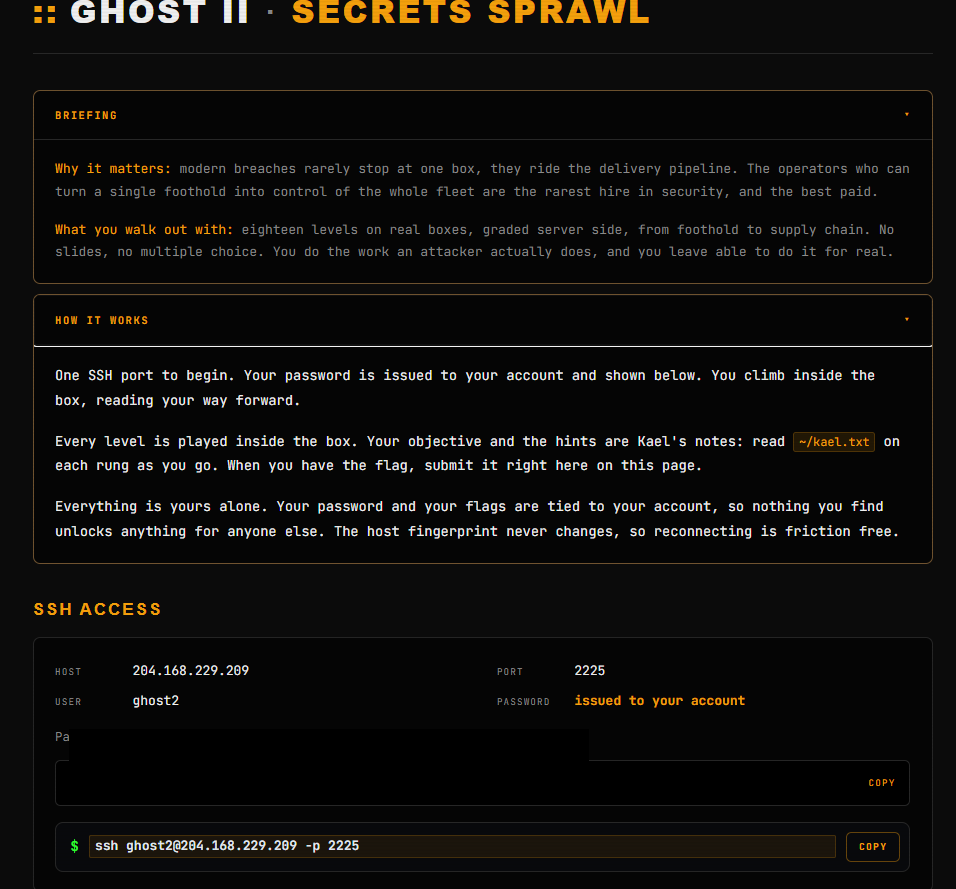

## 🛠️ Tools Used:
- ssh
- getcap

## 🚀 Solution:

### Step 1:
Connected using ssh to the target using the credentials found in the main page:

```bash
ssh ghost2@204.168.229.209 -p 2225
```
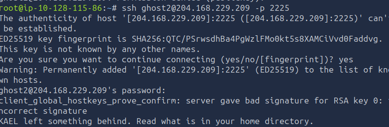

### Step 2:
So immediately, we can infer that we're in a docker container environment based on the fact that our hostname is a bunch of random hexadecimal characters which is the container ID.

For more information on this, see https://docs.docker.com/engine/containers/run/#container-identification

The hostname here is really just a 12 character shortened UUID identifier to ensure that no two containers will ever share the same ID. It also shows us this an epheremearal machine that lasts for a specific session.

We can also know we're in a docker environment by looking at the root of the file system's `.dockerenv` file. (Which in this instance is empty.) As well as under /run/systemd/container, we see "docker".

Now, let's enumerate our machine. First off, we see:
```txt
KAEL left something behind. Read what is in your home directory.
```

So as usual, let's check what's in our home directory:
```bash
ls -laR
```

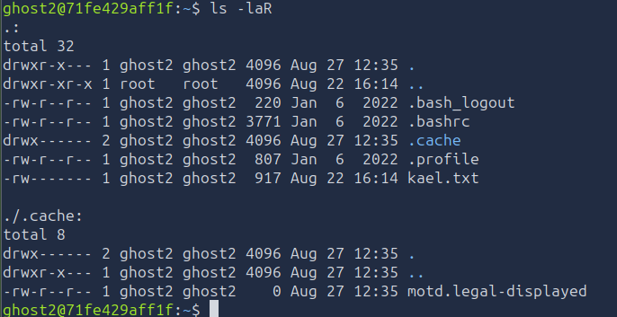
We only have one interesting file `kael.txt` in the home directory, so let's check it out.

```bash
cat kael.txt
```
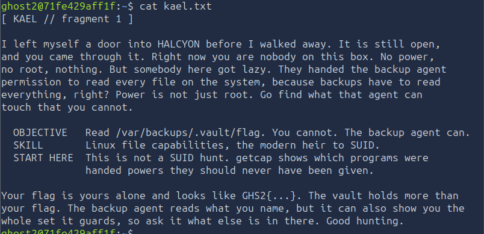

Alright. So let's decrypt that...

We have `HALCYON`, a "door", now this could be an executable, a port, but it's not clear yet.

We have a `backup agent` running that can read every file on the system. And we have to find what that agent can touch.

Our flag is in /var/backups/.vault/flag, so we know where it is, cool.

Finally, we also know our flag is unique, that the vault does hold more than our flag, so more files to go through, and that the backup agent can show us more than just files... Whatever that means. Probably directories.

We already know that SUID (Permission 4000), a classic linux privilege escalation path is NOT used here, so let's not waste our time on that.

The skill that is tested is Linux Capabilities. Before moving on to the actual solution, Step 2.5 will be explaining what Linux Capabilities are and what kind of tools are related to those capabilities.

### Step 2.5 [SKIP IF YOU WISH TO NOT UNDERSTAND]:
Alright, so Linux Capabilities, what they?

Linux Capabilities are merely sets of powers that the root user normally has which are subjected to a split between each power called "Capabilities". There are a total of 41 Linux Capabilities, that list can be found in https://man7.org/linux/man-pages/man7/capabilities.7.html.

### Why are they needed?

In the old ages of Unix Systems, only the Root user had the ability to do anything on the system. This was a problem because if a process was compromised, it would have full access to the system and could do anything. This all changed in Linux 2.2 with the introduction of Linux Capabilities. Now, instead of giving a process full root access, we can give it only the capabilities it needs to do its job.

Without capabilities, you would need to set the SUID bit (See Fundamentals Level 20 for more information on SUID bit) on a binary to allow it to run as root, which is a security risk. Capabilities allow you to give a process only the permissions it needs to do its job, without giving it full root access. Capabilities allow us to reduce the attack surface of our system.

### Representation?

Those capabilites are stored as hexadecimal numbers called "bitmasks" of length 64 bits (1 bit for each capability, 0 is disabled, 1 is enabled).

Hexadecimal uses 4 bits for each character, from 0-9 and then to A-F, A=10, B=11, so on and so on.

A bitmask of 000001ffffffffff means that you have 10*4+1 capabilities enabled. 

Why? Because (F)16 means all 4 bits of the character are turned to 1, (1111)2=(F)16 because `(1111)2` in binary is `(15)10` in decimal.

We have 10 F, so 4*10 + 1 for (1)16.

But what does that actually look like in binary?
```bash
0000000000000000000000011111111111111111111111111111111111111111
```

This means we have 41 capabilites turned on, which is what linux gives to a process by default.

This can be seen through the `capsh` utility's decode feature:  
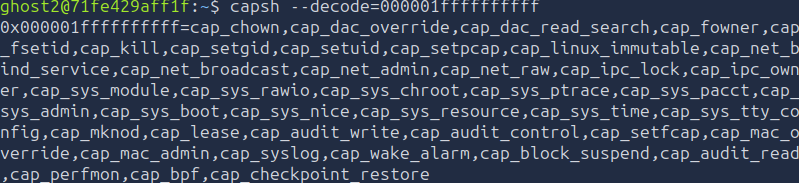

### Capability types?

Now, capabilities have 5 different types in the Linux Kernel.

- 3 Main ones for executables.
- 2 Auxiliaries, those are for processes mainly.

There are two capability models that are used in Systems Administration.

Those are EIP and IAB. 

EIP is commonly used in `setcap` and `getcap`, used precisly for files.

- E for Effective Capability.
- I for Inheritable Capability.
- P for Permitted Capability.

IAB is the syntax you will find in `capsh` or `pam_cap`. It is the modern inheritance syntax. This is used in processes, or it's the one you'll find in `/proc/$PID/status`

- I for Inherible Capability.
- A for Ambient Capability.
- B for Bounding Capability.

### Okay, cool, but what do those do exactly?

- Effective Capabilities (CapEff) is what the kernel verifies in the immiedate, it is what is effectively used for permission control.
- Inheritable Capabilities (CapInh) is what happens to `execve()`, but only when combining with the capabilities of the file that is launched. It is rarely used.
- Permitted Capabilities (CapPrm) are the maximum of what the process can activate, absent capabilities from here are totally off limit.
- Bounding Capabilities (CapBnd), it is the ABSOLUTE limit, a capability that is removed from here will NEVER be regained, not by the process, not by its children.
- Ambient Capabilities (CapAmb) those are the capabilities preserved through the execution of non privileged program, without file capabilities on the binary. Those can be set in the shell, and are inherited by children. Those are the only capabilities that can be added to a process without file capabilities. **This type has a golden rule, you CANNOT have a CapAmb that is not ALREADY in the Permitted AND the Inheritable sets.**

They can be seen in /proc/1/status:  
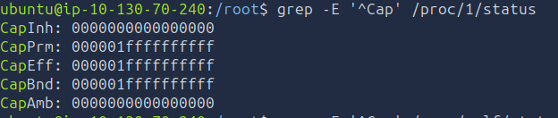
EPB are all set fully.

Can also by using `getpcaps`:  
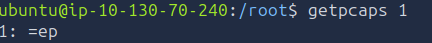

Whereas a non privileged process like an unprivileged user's terminal:  
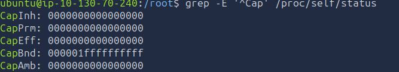

In `getpcaps`:  
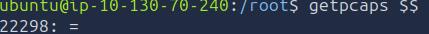

### Note:
To put Ambient Capabilities on for a process, you may use capsh, do it programmatically using the `prctl` syscall.

Easier way is to use (If you can) Systemd's unit files for services using the directives `CapabilityBoundingSet` and `AmbientCapabilities` to set the capability to the application that will inherit the capabilities.

### What is getpcaps?
`getpcaps` is a tool to display process capabilities through their PID value.

Some options I think are relevant are:
- --verbose: Adds quotes around the PID and adds "Capabilities for" as a prefix for each line.
- --iab: Shows it in a different syntax.

Example:  
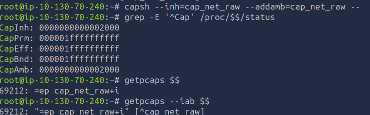
This shows us the three different views and we can see that the 13th bit is set (0010) in inherited and ambient sets. If you try to use capsh using just the `addAmb` parameter, you will get a `failed to raise ambient [<YOUR CAPABITILITY>]` error, because remember the **Golden Rule** for the Ambient set.

Another way we can show this is with `capsh` directly, see below.

### What is capsh?

`capsh` is a powerful utility that allows us to debug, test and understand capabilities better, it is a shell wrapper.

Some useful options:
- --print: Shows all informations related to the current environment's capabilities, the bounding set, the IAB, Ambient set, the uid, gid, euid, groups and the guessed mode (The security profile used by libcap) which can be either `uncertain (0)`, `nopriv (1)`, `pure(2)` or `hybrid(4)`.
- --modes: Lists all supported modes of the currenty user.
- --decode: Decodes the given bitmask.
- --uid: Changes uid (No this doesn't work without root)
- --inh: Adds capabilities to the inheritable set.
- --addamb: Adds capabilities to the ambiant set.
- --noamb: Resets all ambient capabilities.

### Note:
Nopriv COMPLETELY locks down the process (Even if you're root), it is the most secure mode, but it is also the most restrictive. It is used for processes that do not need any capabilities.

It's a neat little trick you can play on your best friend lol.
For example, despite being root, I cannot go into ubuntu's home directory. (On a side note, this is a good way to test if your system is secure, if you can access ubuntu's home directory, then your system is not secure. It means chmod is probably set at 755 or something, it should be 700 at minimum.)  
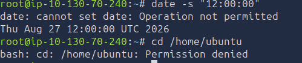


### What is getcap?
`getcap` is a utility that allows us to see the capabilities of a file instead of a process. It is a simple utility that shows us the  names of the capabilities of a file, and it is the one we will be using in this challenge.

Some useful options:
- -v: Displays all the searched entries, basically a verbose mode.
- -r: Recursively searches through directories for files with capabilities.

I suggest redirecting the error standard output to /dev/null when using this command as it is extremely verbose like `find`.

### Other utilities:
There are other utilities that can be used to manipulate capabilities, but they are not as relevant for this challenge.
- setcap: Allows us to set capabilities on a file.
- setpriv: Allows us to set capabilities on a process.


### Capabilities list:
Below you will find an explanation on the most common linux capabilities you will see, some of which we will exploit in the following levels.

- CAP_NET_RAW: Permits the use of raw sockets and packet injection, ping for example has that capability.    
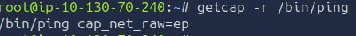
- CAP_NET_BIND_SERVICE: This capability allows a process to bind to network ports below 1024 (Usually only root can do that).
- CAP_SYS_ADMIN: As its name indicates, it is a super capability comprised of everything you would need to cover usual system administration operations
- CAP_CHOWN: Allows processes to arbitrarily change the user and group ownership of a file.
- CAP_DAC_OVERRIDE: Bypasses traditional kernel permission checks RWX operations.
- CAP_SYS_TIME: Change the time of the clock and the timezones.
- CAP_SETUID and CAP_SETGID: Allows processes to alter their own UID and GID credentials.
- CAP_SYS_PTRACE: Permits the use syscalls like ptrace to trace, debug and inspect any other process arbitrarily.
- CAP_DAC_READ_SEARCH: Less permissive than DAC_OVERRIDE, it allows the bypass of reading permissions.
- CAP_AUDIT_CONTROL: Allows to configure, deactivate and activate the audit system of the linux kernel (auditd).

In short, linux capabilities are the powers that can be attributed to processes because using SUID on binaries is the security equivalent of opening your front door with a chainsaw, remember, always use the Principle of Least Privilege.

### Step 3:
Now, let's check the capabilities of the files in the system, we can do this by using the `getcap` utility recursively.
```bash
getcap -r / 2>/dev/null
```

This will take a little bit but we do eventually get a result:  
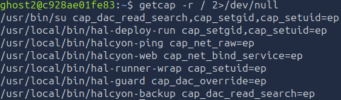

Alright... What's going on here?
We have the classic su binary... And then those weird local programs.

Remember the beginning, "HALCYON" and "backup agent". Strangely enough, we have a `halcyon-backup` program with CAP_DAC_READ_SEARCH.

Do you remember what CAP_DAC_READ_SEARCH does? 

That's right. It gives the capability to bypass traditional read permissions. 

If we go ahead and try to use it:
```bash
/usr/local/bin/halcyon-backup
```


We can see it asks us to use a path under `/var/backups/.vault/`. Cool!

Let's try a path under another directory:
```bash
/usr/local/bin/halcyon-backup /root
```
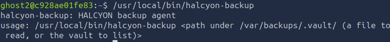

We get an error. So it can't actually read all directories unlike our kael.txt file said. It can only read the vault.

Using it to enumerate the vault gives us:
```bash
/usr/local/bin/halcyon-backup /var/backups/.vault/
``` 
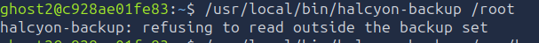

Alright, so we can see the `flag` file and the `deploy.secret` file.

### Step 4:
Now we just need to get the contents of those files.

```bash
/usr/local/bin/halcyon-backup /var/backups/.vault/flag
```
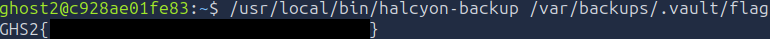

Alright we got our GHS2 flag.

```bash
/usr/local/bin/halcyon-backup /var/backups/.vault/deploy.secret
```
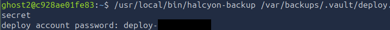

And we can privilege escalate to the deploy account.

### Step 5:
Moved to [Level 2](../Level%202/) from the deploy account.
