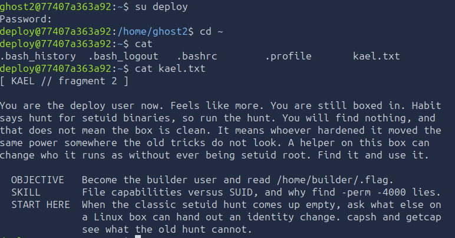
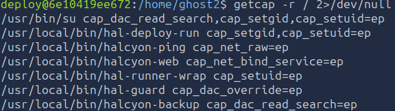
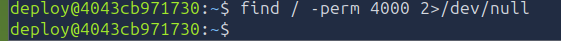
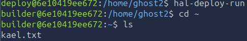
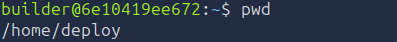
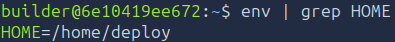
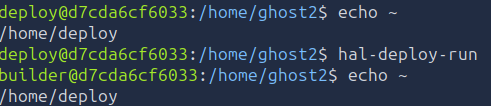
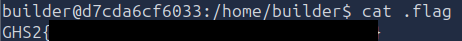

# Level 2 - The setuid That Wasn't
---
**Category:** Foothold

**Points:** 600

**Difficulty:** Intermediate

**Link:** https://breachlab.org/tracks/ghost/ii

## 📋 Description:
This challenge is about capabilities. You will need to find a binary that has the cap_setuid capability set, and use it to escalate to the builder user.

## 🛠️ Tools Used:
- getcap
- cat
- su

## 🚀 Solution:

### Step 1:
Connected using using su with the credentials found in Level 1:

```bash
su deploy
```


### Step 2:
Alright. So what do we have here?

Kael tells us we are the deploy user, that it feels like we have power but we don't and that usually at this point you hunt for SUID binaries. (See Ghost I for more information on SUID).

If we do try to search for SUID binaries, we will find nothing apparently, so let's try.
```bash
find / -perm 4000
```

And indeed, we find nothing:  


Alright, what else?

He tells us that the power was moved elsewhere, and that a "helper" on the machine can change what he runs as without being a SUID root binary. We just need to find it.

So... Remember capabilities? There is one in particular that does about the same thing as SUID does.

And in fact, we can see it with getcap:  


See the /usr/local/bin/hal-deploy-run binary? It has the cap_setuid capability, which is exactly what we need to run as another user.

To understand how that works, we can check a C equivalent source code:
```c
#include <stdio.h>
#include <stdlib.h>
#include <unistd.h>
#include <sys/types.h>
#include <sys/capability.h>

// builder's id and gid
#define TARGET_UID 1001
#define TARGET_GID 1001

int main() {
    // First, the libcap structures are initialized
    cap_t caps = cap_get_proc();
    if (caps == NULL) {
        perror("[-] Error while getting capabilities.");
        return 1;
    }

    // 2. We ensure that the CAP_SETUID and CAP_SETGID capabilites are indeed activated in the effective set.
    // (The kernel put them in Permitted using the intersect equation with the deploy user)
    cap_value_t cap_list[2] = { CAP_SETUID, CAP_SETGID };
    if (cap_set_flag(caps, CAP_EFFECTIVE, 2, cap_list, CAP_SET) == -1) {
        perror("[-] Activating the capabilities in the Effective set is impossible.");
        cap_free(caps);
        return 1;
    }

    // Apply the status change for the rest of the program
    if (cap_set_proc(caps) == -1) {
        perror("[-] cap_set_proc failure");
        cap_free(caps);
        return 1;
    }
    cap_free(caps);

    // Changing the identities
    if (setgid(TARGET_GID) != 0) {
        perror("[-] Changing setgid to builder failed");
        return 1;
    }

    if (setuid(TARGET_UID) != 0) {
        perror("[-] Changing setuid to builder failed");
        return 1;
    }

    printf("[+] Transition success ! Changing identity to builder (UID %d).\n", TARGET_UID);

    // Shell generation for the user
    // The kernel will automatically clean up the capabilities here because the UID isn't root anymore.
    char *args[] = {"/bin/bash", NULL};
    execve(args[0], args, envp);

    // If execve succeeds, the code below is never executed
    perror("[-] Failed to launch the shell.");
    return 1;
}
```

### Step 3:
Changing to the builder user using the the binary:
```bash
hal-deploy-run
```


Now something interesting happens, and that's an effect of `execve`.

Do you think I can look inside that file? If not, why?

The reason is simple, let's take a look at where we are.

```bash
pwd
```


Huh? /home/deploy? But I am the builder user! And it says I am in "~"!

Well... Yes... however let's take a look at the `$HOME` environment variable.

```bash
env | grep HOME
```


Would you look at that... Instead of /home/builder, it says /home/deploy...


### Step 3.5 (A yap about kernel and bash source code, skip if you want to focus purely on the challenge):
The reason for this is simply because our program only changes our UID and GID and then executed `execve(/bin/bash)`. The symbol `~` doesn't look in `/etc/passwd` to know where the user lives, it checks the `$HOME` environment variable. We can see this in the bash source code, in the `tilde_expand` function. So, we are in the home directory of deploy, but we are the builder user:

```c
case '~':
	  /* If the word isn't supposed to be tilde expanded, or we're not
	     at the start of a word or after an unquoted : or = in an
	     assignment statement, we don't do tilde expansion.  We don't
	     do tilde expansion if quoted or in an arithmetic context. */

	  ...

	  if (word->flags & W_ASSIGNRHS)
	    ...
	    tflag = 0;

	  temp = bash_tilde_find_word (string + sindex, tflag, &t_index); // This is our function that finds the tilde expansion, it will return NULL if it can't find it, or a string with the expansion if it can. It will also set t_index to the length of the tilde word.
	    
	  internal_tilde = 0;
    
	  if (temp && *temp && t_index > 0)
	    {
	      temp1 = bash_tilde_expand (temp, tflag);
	      if  (temp1 && *temp1 == '~' && STREQ (temp, temp1))
		{
		  FREE (temp);
		  FREE (temp1);
		  goto add_character;		/* tilde expansion failed */
		}
	      free (temp);
	      temp = temp1;
	      sindex += t_index;
	      goto add_quoted_string;		/* XXX was add_string */
	    }
	  else
	    {
	      FREE (temp);
	      goto add_character;
	    }
```

That function is defined in general.c:
```c
char *
bash_tilde_expand (s, assign_p)
     const char *s;
     int assign_p;
{
    /* sets up flags, then calls tilde_expand() */
    ret = tilde_expand (s);
}
```

And the actual decision happens in lib/tilde/tilde.c:
```c
/* Return a new string which is the result of tilde expanding STRING. */
char *tilde_expand (const char *string)
{
  char *result;
  int result_size, result_index;

  result_index = result_size = 0;
  if (result = strchr (string, '~'))
    ...
  else
    ...

  /* Scan through STRING expanding tildes as we come to them. */
  while (1)
    {
      register int start, end;
      char *tilde_word, *expansion;
      int len;

     ...

      /* Make END be the index of one after the last character of the
	 username. */
      end = tilde_find_suffix (string);

      /* If both START and END are zero, we are all done. */
      if (!start && !end)
	break;

      /* Expand the entire tilde word, and copy it into RESULT. */
      tilde_word = (char *)xmalloc (1 + end);
      strncpy (tilde_word, string, end);
      tilde_word[end] = '\0';
      string += end;

      expansion = tilde_expand_word (tilde_word); // This is the function that will check if the tilde word is a ~ or a ~username and will return the expansion of it. It will check the $HOME environment variable first, and if it's not set, it will check /etc/passwd for the user's home directory.

      ...

      len = strlen (expansion);
#ifdef __CYGWIN__
      ...
#endif
	  ...

  result[result_index] = '\0';

  return (result);
}
```

The definition for that function can be found in `lib/tilde/tilde.c`:
```c
char *tilde_expand_word (filename)
     const char *filename;
{
  char *dirname, *expansion, *username;
  int user_len;
  struct passwd *user_entry;

  if (filename == 0)
    return ((char *)NULL);

  if (*filename != '~')
    return (savestring (filename));

/* A leading `~/' or a bare `~' is *always* translated to the value of
   $HOME or the home directory of the current user, regardless of any
   preexpansion hook. */
if (filename[1] == '\0' || filename[1] == '/')
{
    /* Prefix $HOME to the rest of the string. */
    expansion = sh_get_env_value ("HOME");   /* ← THIS IS THE DECISION */

    /* If there is no HOME variable, look up the directory in
       the password database. */
    if (expansion == 0)
        expansion = sh_get_home_dir ();      /* ← fallback to /etc/passwd */

    return (glue_prefix_and_suffix (expansion, filename, 1));
}
...
```

Alright... So to resume... When you use execve, with envp, it will use the environment variables of the parent process, which is deploy. Then, `copy_strings()` from `fs/execve.c` will copy the environment variables to the new process, and when you type `~`, it will initiate the case for it in `subst.c` that will call bash's `bash_tilde_expand()` function in (defined in `general.c`) which will call `tilde_expand()` (defined in lib/tilde/tilde.c), which calls tilde_expand_word() which will check the `$HOME` environment variable through `sh_get_env_value("HOME")` and return the value of that variable, which is /home/deploy. So, we are in the home directory of deploy, but we are the builder user.

So if we check tilde expansion, we can see that it will return /home/deploy:
```bash
echo ~
```


All of this can be proven by just unsetting the HOME variable and then checking the tilde expansion again:
```bash
unset HOME
echo ~
```


And as we can see indeed, it returns /home/builder, which is the home directory of the builder user found in /etc/passwd.

### Step 4:
Anyhow, our objective is to find the flag, we are now builder, so let's enumerate the files in our home directory:
```bash
ls -laR
```


And here is our flag:
```bash
cat .flag.txt
```


### Step 5:
Moved on to the [next level](../Level%203/), and submitted the flag.