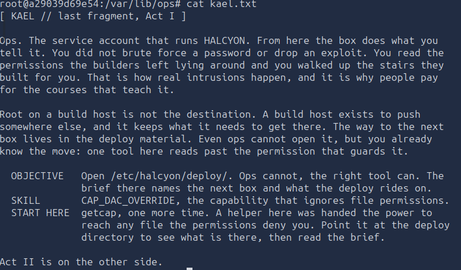
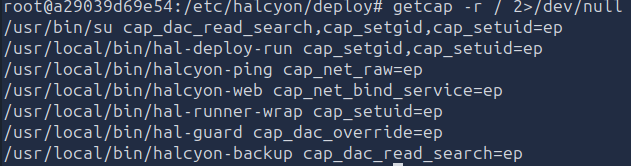
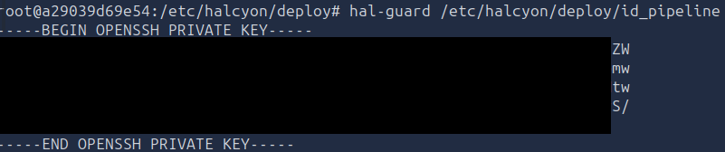
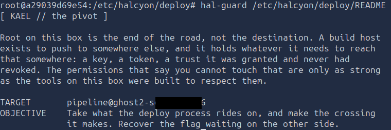
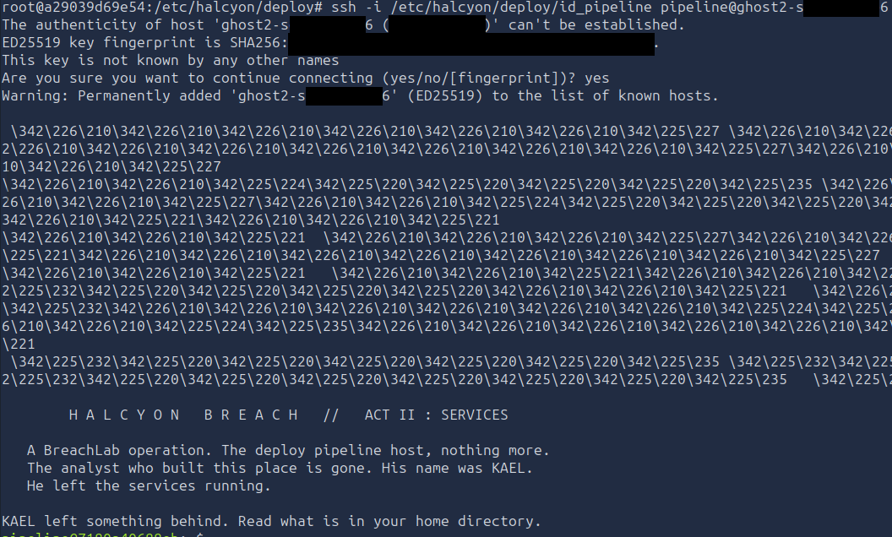
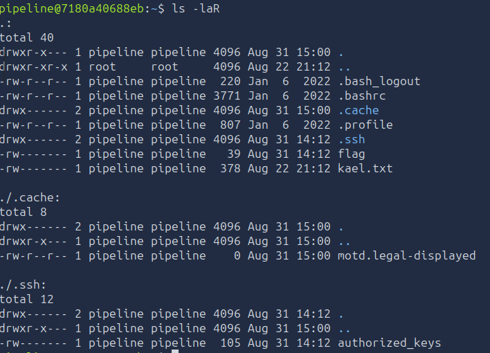
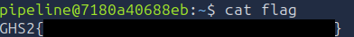

# Level 4 - The Pivot
---
**Category:** Pivot

**Points:** 800

**Difficulty:** Intermediate+

**Link:** https://breachlab.org/tracks/ghost/ii

**MITRE Mapping**: https://attack.mitre.org/techniques/T1021/004/ -- SSH
https://attack.mitre.org/techniques/T1005/ -- Collecting Data From Local System

## 📋 Description:
This challenge is about pivoting. You will need to use the key you found in the level to connect to the next machine and read the flag in the home directory of the pipeline user.

## 📚 What you'll learn:
- If you haven't done Ghost I, you'll learn pivoting with an SSH private key.

## 🛠️ Tools Used:
- ssh
- cat
- getcap


## 🚀 Solution:

### Step 1:
Checking the kael.txt found /var/lib/ops/kael.txt:

```bash
cat kael.txt
```


Alright so... Basically just says this isn't the final destination, correct, just a pivot machine. It mentions /etc/halcyon/deploy, and that we can't open it because we're supposed to be the ops user, which we are not, since we're root we can totally just bypass all of that and just read the file. But let's try understanding the original challenge despite that.

### Step 2:
This will be the third time we've seen this output...

```bash
getcap -r / 2>/dev/null
```


Alright, so we already know we need to find a program with the CAP_DAC_OVERRIDE capability, and the only one that has this? It's hal-guard, so let's try it.

```bash
hal-guard /etc/halcyon/deploy
```


We have two files, a README and id_pipeline, let's see their content.

### Step 3:
```bash
hal-guard /etc/halcyon/deploy/id_pipeline
```


So we have a private key that we can use for ssh.

```bash
hal-guard /etc/halcyon/deploy/README
```


So our flag is just on the other side. Let's use the key to authenticate ourselves.

### Step 4:
```bash
ssh -i /etc/halcyon/deploy/id_pipeline pipeline@ghost2-s#########6
```


And here we are, on the other side.

Let's see our flag.

```bash
ls -laR
```


```bash
cat flag
```


### Step 5:
Moved on to the next level.